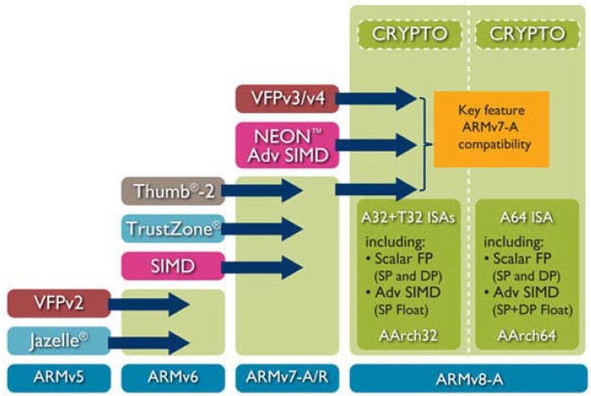
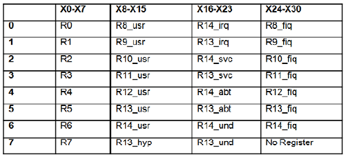
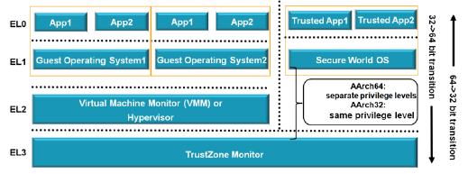
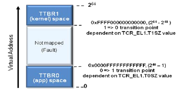

#《ARMv8_white_paper_v5.pdf》

因为ARMv7+LPAE可以解决地址空间不足的问题，所以目前对完整64位指令集的需求并不强烈，但是ARCH的研究需要着眼未来，所以仍开始ARCH64的演进。

指令集：
64位指令集，指令宽度为32位，寄存器宽度为64位，共31个通用寄存器。主要变化：取消条件指令，取消STM/LTM等批量操作指令，简化处理器的设计。

为加速流水线处理，处理器内存采用寄存器重命名技术，扩展可用寄存器的数量，但是对外，仍然只有这些通用寄存器。

寄存器也发生较大变化。AARCH64只有SP、ELR、SPSR专用寄存器。

Exception Level

简化异常模型。比如在MIPS中，使用两级异常，系统模式和用户模式。这里向下扩展，为支持处理器级别的虚拟化，引入VMM。为支持处理器级的安全，再向下扩展，支持TZ monitor。

A64引入专用Excption LR，每一个层次都有一个，宽度为64位。从32位的异常模式向64位异常模式扩展，自动用0填充。

每一级异常都有自己的异常向量表，比如synchronous、IRQ、FIQ、Error等。在向量表中可以得到异常源，详细信息可以从syndrome寄存器中读取。该积存数可以用于虚拟化。

MMU

虚拟地址空间的划分。用户态使用TTBR0，内核态使用TTBR1。物理地址，最高8bit给tagged pointer使用。

#80-NM812-2_A_Driver_64_Bit_Compatibility_in_Kernel.pdf
本文主要介绍64位模式对kernel编程的影响。

##基本数据类型的size变化。
	long   4->8
	size_t  4->8
	pointer 4->8
	char/short/int/long long不变。

应避免在kernel中使用基础数据类型，而应该使用_u32之类的wrapper data type。为保证struct在32位和64位环境下的数据类型长度不变，应该使用union，强制数据类型长度向64位对齐。

64位驱动应该实现compat_ioctl，以保证在64位操作系统下可支持32位的应用程序的ioctl调用。

在数据类型宽度/sysfs，debugfs/mmap方面有所区别。

