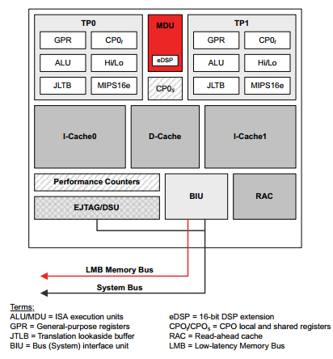
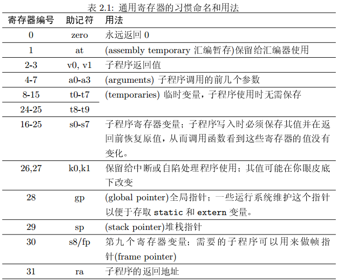
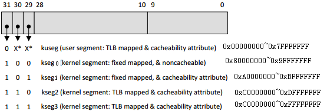
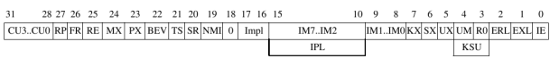
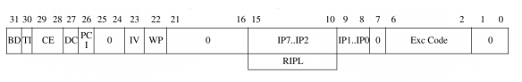
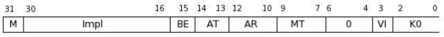
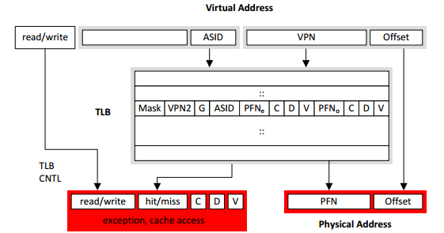

下图是BCM63168芯片使用的BMIPS4350系统架构，如下图所示。MIPS架构把控制功能放在协处理器中，比如EPC、状态寄存器等。
  
 

##第2章 MIPS体系结构

###通用寄存器的速查表。
   
虽然32个通用寄存器，除了$0和$31指定用途外，其他寄存器可以随便混用。但是如果真的这样做，将会程序不可移植。  
s0~s7，在函数调用时，需要保护现场。  
sp寄存器，发生在函数调用的开始和结束时，可以通过这个寄存器加上偏移，存取堆栈变量。  

###加载和存储：寻址方式
MIPS 只有一种寻址方式。任何加载或存储机器指令可以写成
```
lw $1, offset($2)
```
你可以使用任何寄存器来作为目标和源寄存器。offset 偏移量是一个有符号的16 位的数字(因此可以是在-32768 与32767 之间的任何一值)。可以用宏指令，组合多条指令，实现复杂的加载工作，如双寄存器寻址。

###存储器的数据类型
long long  --> dword  --> 8字节  --> “d”  
long  --> word  --> 4字节  --> “w”  
short  --> halfword  --> 2字节  --> “h”  
char  --> byte  --> 1字节  --> “b”  

如果t1存放一个byte宽度的数，值为0xFE（有符号的-2，无符号的254）  
lb   t2 0(t1)   执行之后，t2的值为0xFFFF FFFE（有符号数-2），高位用符号位来填充  
lbu t3 0(t1)  执行之后，t3的值为0x0000 00FE（无符号数254），高位用0来填充  

内存本身是没有意义的，有意义的是如何对内存做出解释。比如0xFE，可以解释为-2，也可以解释为254。比如一个浮点数，如果没有解释，那么它就是一个大整数。

MIPS有严格的对齐要求，2字节必须只能从双字节的边界加载，字只能从4字节的内存边界加载（也即最低两位必须为0）。linux利用这一特性，会将一个指针的最低2位bit挪为他用，有的时候用来表示指针的特性。只有在使用到这个指针的时候，才将最低2个bit位清零。

###基本地址空间
  
* kuseg，用于用户态进程，需要MMU将地址转化到物理地址。
* kseg0，把最高位清零就得到物理地址，映射连续的512M内存。需要通过告诉缓存来存取，有MMU时放操作系统内核代码。无MMU放程序。在linux内核中，对应的操作宏为__pa, __va。
* kseg1，把最高三位清零得到物理地址，本区域的地址不经过高速缓存，适合于放I/O寄存器。这也是63168的寄存器大都是0xb0000000地址范围内的原因。
* kseg2和kseg3，使用MMU才能转化到物理地址，这段内存通常用于内核vmalloc。
注意到，这种情况下只能使用512M以下的内存，所以对于大的内存要如何映射，需要用到高端内存。

###流水线可见性
讨论流水线可见性，主要是为了放置编译器过度优化，导致代码执行不正常。同时可以充分利用部分指令的延迟，提升效率。
* 分支延迟  紧跟着分支指令后的那条指令，即使跳转成功也会执行。因此可以在这个延迟槽中放一条有效的指令，比如做个算数运算之类的。
* 加载延迟  和分支延迟类似，存在延迟槽。延迟槽通常为一个指令。数据在装载后的下下一条指令即可用。如果一个加载需要很长时间，那么就需要在加载完成之前，锁住cpu，不让它继续往后执行。（延迟一个指令是允许的）


##第3章  协处理器  控制cpu的运行
仅仅算数运算，对于一个cpu来说是远远不够的。它至少还需要一些功能，如高速缓存、定时器、中断、内存管理、调试。一个协处理器，包含寄存器集合和指令集合。
* 上电后，需要设置SR寄存器，使CPU进入可工作的状态。
* 异常时，将返回地址被存在EPC中，此时，尚未保存任何程序寄存器。
* 从异常返回，返回到EPC中存放的地址继续执行。并恢复SR、用户态特权、及之前的堆栈。
* 中断，系统调用，断点调试。都需要协处理器协助处理。

mips中实际包含四个协处理器
* CP0，系统控制协处理器，必须。通过读写CP0的寄存器，实现对cpu底层的控制。
* CP1，浮点协处理器，可选。
* CP2和CP3略过不提。

由于对CP0寄存器的修改，需要几个时钟才能传达到硬件，也即寄存器的生效存在延时。一种方法是硬件对所有可能发生延时出现错误的地方加锁，另一种方法是软件在设置CP0寄存器后，加入nop指令等待。但是第2种方法，计算要加入多少个nop，也是很麻烦的事情。所以MIPS引入了一些放置cpu冒险的指令，包括ehb，jr.hb, jalr.hb。没看懂，后面再想。

###一些有趣的协处理寄存器：
有的寄存器编号为12.1之类，在汇编指令中表示为$12,1 解释为register12，select 1。相当于select寄存器。在实际写汇编代码的时候，不应该直接引用寄存器的编号，而应该使用助记符。

####状态寄存器SR的bit位的作用。
   
* CU3..CU0，控制哪些协处理器使能。
* IM7..IM2，哪些CPU核外部的中断源活动时产生异常
* IM0..IM2，cause寄存器设置

####原因寄存器的bit位的作用
   
* IP7..IP0，和IM7..IM0对应，表示待决的中断。
* Exc Code，用5个bit位，也即32个值，表示异常的原因。通常在内核异常的时候，Oops信息中都会把它解释出可读的原因。
* EPC 异常返回地址 保存异常返回点。如果异常无法返回，那就在oops信息中打印出来。我还以为epc的地址无法返回呢。
* 无效虚拟地址BadVaddr  保存引发内存异常的地址，包括MMU异常如缺页异常，用户态进程访问kuseg以外的地址，未对齐地址。

####Count/Compare寄存器
Count是一个无符号的32bit的数值，溢出后归0，以流水线的同频运行。当count寄存器的值增加到compare寄存器的值时，就触发中断。下一次写入compare值后，中断消失。通过这种方式，可以实现一个高精度的定时器。与主cpu的时钟同频的定时器。纳秒级别的定时器。牛啊。

####处理器ID寄存器
公司ID，公司选项，处理器ID之类的。 
  

####Config、Config1~3寄存器
保存CPU的信息，只读。BE为大端小端。AT指令集是32位还是64位或兼容模式。高速缓存相关配置寄存器（在Config1~3中。）

####EBase和IntCtl寄存器
Ebase允许定义一个CPU的所有异常点，用于共享内存的多处理器系统，这样不同的cpu就不必用相同的异常处理程序。有趣的特性，不过不理解这里说的不同的cpu，和相同cpu不同线程是否相同的概念。
  

   
##第4章  MIPS的高速缓存机制
高速缓存，就是CPU中的D-cache和I-cache。cpu并不总是尝试去内存中读数据，如果数据已经被加载到高速缓存中，那么直接load到寄存器中即可。反之，写数据的时候，也并不是立即写入内存，而是先写到高速缓存中。高速缓存中的数据需要通过write-back这样的机制，同步到内存中。考虑突然在写入缓存之后，尚未同步数据之前，断电，可能造成数据丢失。


##第5章  异常、中断及初始化
外部引脚电平变化引起的异常称为中断。TLB地址转换异常，比如缺页异常，或访问非法的、无权限的地址。非法指令，整数溢出，高速缓存数据完整性检测失败等，都会产生异常。另外一种更常见的异常，是操作系统精心定义的异常，用来实现系统调用或自陷的功能。
**精确异常**
想象一下MIPS的五级流水线，如果某一条指令出现异常，那么流水线上的其他异常怎么办。分为两种情况，这条指令之前的指令不应该被执行，这条指令之前的指令应该被撤销，就像没有执行一样。这对芯片设计者来说是个挑战，不过对于cpu的使用者来说，我觉得知道有这么回事就行了。对程序设计没有太大影响。
**异常向量**
大多数CISC处理器由硬件来处理异常，分析异常的类型，将cpu送到不同的入口点，甚至能够定义某个中断的入口点位置在哪里。但RISC认为这样做了是吃力不讨好的。因为硬件没有办法做太多灵活的东西，将异常送到一个固定的入口点，由软件来根据异常类型分发，更为灵活。软件不用和硬件协作，可以控制中断的优先级。  
现实，在体系结构的发展过程中，不是所有异常的入口点都在一起，那样性能的确没有那么好。当然也没有像CISC那样，每个中断都有一个入口点
* 用户态地址的TLB重填充特别频繁，被赋予一个特殊的入口点，避免软件判断是那种异常，提升效率。
* 默认情况下，中断入口点位于高速缓存区的存储区，但在高速缓存区可用之前，使用SR(BEV位)，将中断引入到一个特殊定位的入口点，位于kseg1区。
* 高速缓存区本身发生了奇偶校验错误，自然不能将异常点入口放在高速缓存区。也只能将入口函数放到kseg1。

MIPS处理一个异常，需要做的事情：
1. 设置EPC指向重新开始的地方
2. 设置SR(EXL)位，强制cpu进入内核态，并禁用中断。
3. 设置Cause寄存器，便于软件查看异常的原因。也就是说，Cause寄存器是在中断发生之后，软件记录的。此时还没有进入到异常处理程序中。
4. cpu开始从异常点入口取指令，然后由软件处理后续的事情，比如触发一个oops。

异常处理的基本过程
1. 引导  异常处理程序的入口，读取k0和k1寄存器，引用到可以保存其他寄存器的内存空间
2. 处理不同的异常   查询cause, 为不同的异常调用不同的处理函数
3. 构造异常处理环境   将中断和寄存器保存到专用的堆栈上下文中
4. 处理异常。为防止异常嵌套，需要合理地关闭异常。及时不能管理，异常也需要有优先级，防止无限制地嵌套。
5. 准备返回   恢复寄存器，恢复SR的状态值
6. 从异常返回    有一条eret指令，负责原子地从异常返回之前的执行点


##第6章  底层内存管理与TLB
  
从顶向下看，硬件被称之为存储器管理单元MMU，从底向上看，主要集中于TLB。

**TLB**  
TLB(Translation Lookaside Buffer)翻译后备缓冲器是一个内存管理单元用于改进虚拟地址到物理地址转换速度的缓存。TLB是一个小的，虚拟寻址的缓存，其中每一行都保存着一个由单个PTE组成的块。如果没有TLB，则每次取数据都需要两次访问内存，即查页表获得物理地址和取数据。

TLB包括指令页缓存、数据页缓存、大尺寸指令页缓存，大尺寸数据页缓存等集中。大尺寸TLB是否存在，取决于CPU架构。TLB的条目数不是特别多，在63168芯片中，为32条。因此，存在命中和失败的可能性。

TLB缓存的是页表数据，和CPU的一级、二级缓存的是实际数据。都是为了加速数据访问。
TLB是CPU的一个模块，与物理内存无关，在用户态或内核态，都可以访问，不存在地址空间权限的问题。

TLB的条目理论上是可以编辑的，不过不知道实际有没有软件这样做过。

ASID为进程的标志符，对应各个进程的页表目录的根地址。

###MMU
需要操作系统和硬件一起协作，完成内存管理的工作。使用MMU的目的：
1. 隐藏和保护。比如用户态的进程不能访问内核态的地址空间。
2. 提供连续地址空间。物理内存可能支离破碎，但使用者却需要大块的连续内存。使用MMU，可以为使用者分配大块的虚拟地址空间。由MMU将之转换到各个物理page。
3. 扩展地址空间。由于只有kseg1和kseg0的512M可用，所以当内存更大的时候，需要MMU来扩展地址空间。
4. 在进程间共享内存。比如各个进程都会使用到的liba.so，就没有必要在所有进程的地址空间中保留一份。
5. 按需调页。一个大的应用程序中，可能很多的代码或数据使用频率非常低，不需要常驻内存，只在用到的时候才加载。使用按需调页，可以提高内存使用效率。
6. 重定位。不需要在编译期间，就确定所有函数或变量运行时的物理地址，只需要在进程启动的时候实用MMU做地址重定向。
早期的嵌入式cpu为降低成本，可能省掉MMU。

##第8章 MIPS指令集
MIPS CPU的一次操作可加载或存储1到8个字节的数据。由于乘法的结果返回的速度不足以使下一条指令能够自动得到这个结果，乘法结果寄存器是互锁的（interlocked）。在乘法操作完成之前试图读取结果寄存器就是导致CPU停止运行，直到完成。

和其他一些更简单的RISC体系结构相比，MIPS体系结构的目标之一是：体系结构朝着64位发展，从而使得地址的段式结构变得没有任何必要。（在64位版本的X86核PowerPC中还有这个负担）

功能分组：
1. 空操作：nop、ssnop（不能和其他指令同时发射，至少需要一个时钟周期）
1. 寄存器间的数据传送指令：move、movf、movt、movn、movz（后四个为条件传递指令）
1. 常数加载指令：dla、la（获取某些标号地址或程序中变量地址的宏指令）；dli、li（加载常数立即数指令）；lui（加载高位立即数指令）
1. 算术/逻辑操作指令：addu、addiu、daddu，daddiu（加法指令）；dsub、sub（会触发溢出陷入的减法操作）；dsubu、subu（普通减法指令）；abs、dabs（求绝对值操作）；dneg、neg、dnegu、negu（一元非操作）；and、andi、or、ori、xor、xori、nor、not（按位逻辑指令）；drol、dror、rol、ror（循环左移和右移）；dsll、dsll32、dsllv（64位左移，低位补零）；dsra、dsra32、dsrav（64位算术右移指令）；dsrl、dsrl32、dsrlv（64位逻辑右移指令）；sll、sllv（32位左移指令）；sra、srav（32位算术右移指令）；srl、srlv（32位逻辑右移指令）；slt、slti、sltiu、sltu（硬件指令，条件满足就写入1，否则写0）；seq、sge、sgeu、sgt、sgtu、sle、slue、sne（根据更复杂的条件设置目的寄存器的宏指令）
1. 整数乘法、除法以及求余指令：ddiv、ddivu、div、divu（整数除法的3操作数宏指令分别处理64位或32位有符号或无符号数）；divo、divou（明确该指令是带有溢出检查的除法指令）；dmul、mul（3操作数64位或32位乘法指令，没有溢出检查）；mulo、mulou、dmulo、dumlou（乘法宏指令，如果结果不能存入一个通用寄存器，发生溢出，触发异常）；dmult、dmultu、mult、multu（执行有符号/无符号32/64位乘法的机器指令）；drem、dremu、rem、remu（求余操作）；mfhi、mflo、mthi、mtlo（用于访问整数乘除单元的结果寄存器hi和lo）
1. 存取指令（内存访问指令）：lb、lbu（加载一个字节，高位可以补零，或进行符号扩展，以补充整个寄存器的长度）；ld（加载一个双字）；ldl、ldr、lwl、lwr、sdl、sdr、swl、swr（向左、向右加载、存储一个字、双字）；lh、lhu（加载一个半字，高位可以补零，或进行符号扩展，以补充整个寄存器的长度）；lw、lwu（加载一个字）；pref、prefx（把数据预取到缓冲）；sb、sd、sh、sw（存储字节、双字、半字、字）；uld、ulh、ulhu、ulw、usd、usw、ush(地址非对齐的数据存取宏指令)；l.d、l.s、s.d、s.s（存取双精度和单精度浮点数的指令，地址必须对齐）；ldxcl、lwxcl、sdxcl、swxcl（采用基址寄存器+偏移寄存器的寻址方式存取指令）；
1. 跳转、分支和子程序调用指令：j（无条件跳转到一个绝对地址，访问256M的代码空间）；jal、jalr（直接或间接子程序调用，这种跳转不仅能跳转到指定地址，而且可以顺便把返回地址（当前指令地址+8）放到ra寄存器中）；b（基于当前指令地址的无条件相对跳转）；bal（基于当前地址的函数调用指令）；bc0f、bc0f1、bc0t、bc0t1、bc2f、bc2f1、bc2t、bc2t1（根据协处理器0和2的条件标志进行跳转）；bc1f、bc1f1、bc1t、bc1t1（根据浮点条件标志位进行跳转）；beq、beq1、beqz、beqz1、bge、bge1、bgeu、bgeu1、bgez、bgez1、bgt、bgt1、bgtu、bgtu1、bgtz、bgtz1、ble、ble1、bleu、bleu1、blez、blez1、blt、blt1、bltu、bltu1、bltz、bltz1、bne、bnel、bnez、bnezl（双操作数和单操作数的比较跳转指令）；bgeza1、bgeza11、bltza1、bltza11（如果需要 ，这些指令是用于有条件函数调用的原始机器指令）；
1. 断点及陷阱指令：break（产生一个“断点”类型的异常）；sdbbp（产生EJTAG异常的断点指令）；syscall（产生一个约定用于系统调用的异常类型）；teq、teqi、tge、tgei、tgeiu、tgeu、tlt、tlti、tltiu、tltu、tne、tnei（条件异常指令，对一个或两个操作数进行条件测试）；
1. 协处理器0的功能：cfc0、ctc0（把数据拷进和拷出协处理器0的控制寄存器）；mfc0、mtc0、dmfc0、dmtc0（在通用寄存器和协处理器0寄存器之间交换数据）；cfc2、ctc2、dmfc2、dmtc2、mfc2、mtc2（协处理器2的指令）；

##第9章 阅读MIPS汇编代码
\#include：利用C预编译器cpp提供的功能，为常数定义一些简单的文本替代宏操作。

.set：指导汇编器如何工作（排列指令顺序）。.set noreorder将底层的分支延迟槽暴露出来，那么我们就必须确保加载的数据不被紧接着的指令使用。

LEAF是在mips/asm.h中定义的宏，用于定义简单的例程，非LEAF例程需要大量的工作来存储变量，返回地址等信息。

句法：标号和变量的标识符可以是C语言中的合法标识符，同时可以包含“$”和“.”。MIPS汇编语言中并没有对应于C语言“指针”的操作符，但当汇编器需要一个指针大小的数据时，会用一个标号来代替。“.”表示当前指令或数据声明的地址，甚至对它们进行一些简单数学运算。在带常量（立即数）的计算指令中，一般的算术指令立即数都采用符号扩展，逻辑操作都采用补0扩展。

寻址模式：硬件只支持一种寻址方式，基址寄存器+偏移，然而，汇编器会调整代码，可以以多种方式寻址：
* 直接寻址：数据标号或者外部变量名
* 直接+索引：以标号位置为基准，由寄存器指定偏移量
* 常量：大数，绝对32位长地址
* 寄存器间接寻址：基址寄存器+偏移

目标文件和内存布局：  
    ROM程序的目标代码段和典型内存布局入下图所示。_ftext为代码段起始点；etext为代码段结束点；_fdata为初始化数据起始点；edata为初始化数据结束点；_fbss未初始化数据段起始点；end为未初始化数据结束点。

   C和其他程序语言的编译器都是将整个程序划分为许多模块，分别编译。为了使彼此能配合操作系统工作，编译的代码模块之间遵循一些调用接口约定（由编译器强制，因此汇编程序员也强制），包括寄存器的使用，堆栈建立和参数传递等。

MIPS没有专门的I/O指令，这说明I/O操作和所选地址的普通的加载存储操作一样。关键字volatile提醒编译器它后面所定义的变量随时都有可能改变，因此编译后的程序每次需要存储或读取这个变量的时候，都会直接从变量地址中读取数据。如果没有volatile关键字，则编译器可能优化读取和存储，可能暂时使用寄存器中的值，如果这个变量由别的程序更新了的话，将出现不一致的现象。用C写设备驱动比汇编容易，但使用中要注意合理选择。特别要注意了解工具链的工作方式，如何在你的高级语言代码中嵌入低级汇编指令，并确保系统按照你期望的方式运行。

##第13章 MIPS架构下Linux内核的分层结构

##第14章 Linux下软硬件怎么协同
中断处理的详细流程。
1.  外部器件通过高低电平，触发一个中断信号给cpu。其实就是将cpu相关的管脚配置为输入模式，可以接受外部输入。由于cpu有的时候会禁用中断，所以应该还需要一个中断管理硬件发送中断，避免中断丢失。
2.  cpu在每个时钟周期轮询输入。强调，每个时钟周期。所以，需要cpu支持对外部输入管脚的快速轮询。由硬件支持。
3.  cpu检测到输入，设置SR寄存器，下次取指的时候接收一个异常。对于一个500MHZ的cpu，从检测到输入，到取值，大概8纳秒。
4.  置位异常状态为SR(EXL)，忽略后续中断，进入内核特权级。控制转入通用异常点。
5.  根据Cause寄存器，选择合适的中断。Cause(ExcCode): 0表示中断。Cause（IP7~2）表示中断号irq。Cause(IM7~2)表示中断掩码。
6.  通用异常处理程序保存所有的通用寄存器和部分控制寄存器SR、EPC、Cause。
7.  清零Cause(EXL)和Cause(IE)，避免再次异常。
8.  do_IRQ()，参数为保存寄存器的结构体。有选择性地禁用特定中断。
9.  调用handle_IRQ_event()处理相应的中断。设置中断掩码，可以部分关闭中断。一个中断号，可以有多个中断处理程序。
10. handle_IRQ_event()再次禁用中断后返回。
11. 检查全局标志位needs_reshsched，判断是否要求重新调度。若全局的preempt_cout非零，就不用重新调度。？？？？
12. 恢复寄存器、SR、EPC，然后调用eret指令，恢复到之前的状态。

为加速中断处理流程，使用软中断处理耗时操作。另外，中断发生时，如果可以减少需要保存的寄存器，甚至不从异常处理流程中退出，或可以提高实时性。

linux内核2.6支持抢占，一个内核线程抢占其他内核线程。触发条件，与中断有关系。或与needs_reched和preemtp_count有关系？

系统调用的处理流程，可参考中断处理流程。
1. 使用syscall指令触发异常，参考外部管脚触发的异常。
2. 检测SR(ExcCode)寄存器，得知异常原因为中断。保存当前通用寄存器和部分控制寄存器后。
3. 以寄存器的方式传递参数，避免内存拷贝。但是如果参数较多，超过4个，也即超过寄存器中用于保存参数的个数，则还是需要放在内存中的。
    1）系统调用号放如v0。返回值其实也放在v0。pipe系统调用，返回值超过两个，则另外一个放在v1。
    2）参数放在a0~a4，超过的放在内存中。（不过这里，是放在核心态内存，还是用户态内存？）
4. 保存参数到寄存器或内存，设置SR寄存器到特权状态。
5. 查找到相应的中断函数开始处理。由于用户态的参数是不可靠的，所以需要做检查，包括数组下标、指针、缓冲区长度等。
6. 执行完毕后，通过eret指令返回之前的位置。
和用户态交互数据，使用到了copy_from_user和copy_to_user。用户态的指针地址也有特殊的标记__user


##第15章 Linux内核下MIPS特有的问题


 


 
