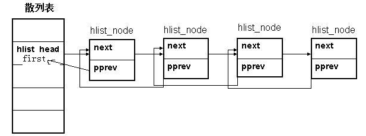

#hlist_head

##数据结构
内核中，使用list_head作为链表，该数据结构本身即使head又是node。如果将它作为hash list的头节点，那么每个头节点会占用8个字节。因此内核中对其优化，使用hlist_head作为hash表的头节点。内核中定义其数据结构为：
```c
struct hlist_head { 
struct hlist_node *first; 
};
struct hlist_node { 
struct hlist_node *next, **pprev; 
};
```
注意到，这里的pprev是一个二级指针。为什么这样设计呢，有什么优点？  

  
在上图中，pprev是指向前一节点next指针的指针。first是hlist_head的字段，指向第一个节点。

##关键函数
```c
static inline void hlist_add_head(struct hlist_node *n, struct hlist_head *h) 
{ 
struct hlist_node *first = h->first; 
n->next = first; 
if (first) 
  first->pprev = &n->next; 
h->first = n; 
n->pprev = &h->first; 
}
 
static inline void __hlist_del(struct hlist_node *n) 
{ 
struct hlist_node *next = n->next; 
struct hlist_node **pprev = n->pprev;
/*这里修改的其实是它的前一节点的next值。无论该节点是不是头节点*/     <<<<1 
*pprev = next;   
/*这里修改它的后节点的pprev值，比较好理解。*/
if (next) 
  next->pprev = pprev; 
}
```
 
如果hlist_node中使用的是单级指针，那么在1处就需要判断节点是否为头节点。可以用n->prev是否被赋值，即是否为NULL来区分头结点和普通节点。在add和delete时都很容易保证头节点的prev为NULL。
比如这样判断：
```c
struct my_hlist_node *next = n->next ;
struct my_hlist_node *prev = n->prev ;
if(n->prev)
    n->prev->next = next ;
else
    n->prev = NULL ;
if(next)
    next->prev = prev ;
```
为什么不这样做？有两个原因：  
1. 代码不够简洁优雅。使用hlist_node，头结点和普通节点是一致的。
2. pprev有一个作用，在hlist_unhashed()中有体现。
```c
static inline int hlist_unhashed(const struct hlist_node *h) 
{ 
return !h->pprev;   /*是否为NULL，被用来判断节点是否加入到hash list中。*/ 
}
```

