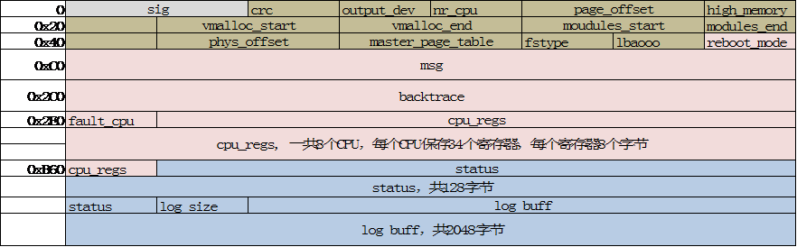

% MTK ramdump功能的设计与实现
% Author: jincheng_liu

摘要：
---
userspace的进程崩溃时，linux kernel会转储崩溃现场到core文件中，供开发者分析故障原因。而kernel自身崩溃，则需要借助其他工具来转储现场。现有的这类工具包括diskdump，kdump。MTK平台使用aee机制来转储内核崩溃现场，产生两种core文件，SYS_MINI_DUMP，只记录崩溃现场的关键信息，SYS_CORE_DUMP，除了崩溃现场关键信息外，还会将完整的DDR抓取出来供分析。

本文总结MTK的内核转储功能的设计与实现。

# 主要接口
## Android
### push volup+power for 10 seconds

### ro.build.type
MTK会控制user build下不做full ramdump功能。原理，当aee检测到ro.build.type为user时，就不会去分配/data/No_Delete.rdmp文件。如果一定要在user下支持full ramdump，需要找MTK提供去掉这个限制的aee binary。

或者使用如下步骤去替换build.type

1. 下载boot zip，使得手机有root权限。
2. adb pull /system/build.prop .
3. 修改build.prop中的ro.build.type为userdebug，并使用adb push替换原有的system.prop
4. check persist.mtk.aee.allocate 为fullmem。如果不是，修改为fullmem。
5. 重启手机。
6. 检查是否有/data/No_Delete.rdmp文件产生。

# 在Kernel中保存寄存器和栈的信息
## KE发生，触发同步异常
### kernel page fault
在log中，出现“Unable to handle kernel page request at virtual address 0xdead”，表示出现这种异常。

当检测到PC访问到bad memory时，会检测到异常发生在用户态或者内核态。如果发生在用户态，则有可能是缺页异常，由__do_user_fault处理。如果是内核态，使用__do_kernel_fault处理。kernel提供修复机制，根据pc指令地址去exception table中搜索一个新的pc重新开始执行。在手机中，通常是直接使用die()退出系统执行。

```
do_bad_area()
    +--> user_mode, __do_user_fault
    +--> kernel mode， __do_kernel_fault
        +--> fixup_exception(regs)
        +--> 打印关键信息，比如“Unable to handle...”，和address的页表项信息
        +--> die()
```


## arch die/panic
在系统trap或fault时会调用die()函数重置系统, 涉及到trap.c和fault.c。业务模块，比如net，mm模块检测到无法挽救的错误，调用panic函数中止系统的执行。相当于kernel级别的exit函数。die()函数是对panic的封装，用于异常处理上下文，在异常无法挽回时重置系统。kernel的异常上下文包括如下类型：

* fault, kernel page fault（__do_kernel_fault）,
* fault, data abort（do_mem_abort），
* fault, 栈对齐异常（do_sp_pc_abort）,
* fault, debug exception，
* trap, 未定义指令（do_undefinstr），
* trap, bad mode，正常模式下不可能走到的exception类型

在这些异常中，有可以分为fault和trap两种。出错（fault）和陷入（trap）最重要的一点区别是他们发生时所保存的EIP值的不同。出错（fault）保存的EIP指向触发异常的那条指令；而陷入（trap）保存的EIP指向触发异常的那条指令的下一条指令。因此，当从异常返回时，出错（fault）会重新执行那条指令；而陷入（trap）就不会重新执行。这一点实际上也是相当重要的，比如我们熟悉的缺页异常（page fault），由于是fault，所以当缺页异常处理完成之后，还会去尝试重新执行那条触发异常的指令（那时多半情况是不再缺页）。陷入的最主要的应用是在调试中，被调试的进程遇到你设置的断点，会停下来等待你的处理，等到你让其重新执行了，它当然不会再去执行已经执行过的断点指令。

如下是die()函数的大致流程。它主要包含Oops和panic两部分。当进入Oops流程时，不会直接将打印内容印到控制台，等待退出控制台时在打印。此外，还会将trace off，不再记录trace信息。debug locks off，因为此时kernel已经不再可信。

```c
die()
    +--> oops_enter() 进入oops流程
    +--> console_verbose() 调整console的打印级别，避免因为级别低，在uart上看不到log。可以在此函数中调整默认打印级别。
    +--> __die(str, err, thread, regs)
    +--> 尝试crash_kexec(regs);抓取kernel coredump。MTK没有使用该流程。
    +--> oops_exit();
    +--> panic() 重置系统。
```

__die()流程中，收集异常信息，与arch相关。此外，还需要使用notifier通知关联模块去做die前的准备工作（比如buffer回写？）。如下是大致的代码流程。

```c
__die()
    +--> notify_die() call die_chain 上的所有notifier
    +--> print modules, regs, backtrace, stack
    +--> 尝试打印userspace code
```

panic()流程中，会通知管理模块系统即将重启，并使用watchdog或者emergency_restart()重启手机。目前MT6753中实际使用的是emergency_restart()来重启手机。该流程需要在关闭cpu本地中断的情况下执行。执行到该函数的关键打印语句"Kernel panic - not syncing:"。大致流程：

```c
panic()
    +--> local_irq_disable(); / panic_smp_self_stop()
    +--> htc_set_reboot_reason_ramdump_by_panic(buf);
    +--> smp_send_stop() 通过IPI停止其他的core
    +--> atomic_notifier_call_chain(&panic_notifier_list, 0, buf);
    +--> touch_nmi_watchdog(); 使用no-maskable interrupt watchdog重启手机，取决于arch是否实现
    +--> emergency_restart() 最终调用到arch_reset去重启手机
```


## ipanic_rom
MTK的ipanic模块在die或panic流程中注册了两个notifier，用于收集系统的各种信息。包括，但不限于以下信息：

* 各个cpu的寄存器信息
* 各个cpu的栈信息
* 检查寄存器，如果是合法地址，则准备该地址前后的内存信息。
* printk buffer
* device log的bugger
* ...

## ipanic_die
在aee初始化时，register_die_notifier(&die_blk);注册die流程的notifier，其handle为ipanic_die。watchdog time out或者Kernel panic都会调用到该流程。区别在于，当kernel panic，会进入到full ramdump流程，将出KE的cpu的寄存器信息保存到full ramdump控制块，保存完毕后直接重启，后续arch相关的die和panic流程将不会被执行到。而watchdog timeout的issue，通常需要结合所有cpu的最后寄存器信息，以及更多的log来分析。所以，针对这类issue，跳过full ramdump保存寄存器信息的过程(mini dump已经有保存)，继续执行后续arch的die和panic流程。特别地，aee向panic流程中注册了一个notifier，用于保存log到sdcard。

```c
ipanic_die()
    +--> mrdump_mini_ke_cpu_regs(dargs->regs); 将寄存器/栈/stack等信息保存到minidump在memory中的控制块。
    +--> aee_rr_rec_exp_type(2); 只有在exp_type为0时才有意义。从而使得Watchdog和KE得以区分开。
    +--> flush_cache_all()  将cache中的内容刷到ddr中，之后ddr中的信息丢失，和cache一致。
    +--> __mrdump_create_oops_dump， KE/Oops/recursive KE，进入full dump流程。
         Watchdog issue实际上也是触发KE重启。
         如果是KE，进入full dump流程后，将不会再返回。如果是watchdog exception，则不进入该函数。
    +--> smp_send_stop() 通过IPI stop其他core。
```

在ipanic_die函数中会进入full ramdump的函数。如果full dump控制块没有设置，或者userspace通过sysfs的mrdump_enable关闭了full dump，也不会进入full ramdump流程。在MT6753中，一旦进入full ramdump流程，就不会再退出。

```c
__mrdump_create_oops_dump -> __mrdump_reboot_va   印log，准备full ramdump
    +--> __mrdump_reboot_stop_all(crash_record, cpu);  停止其他cpu
    +--> crash_save_cpu(regs, cpu);  将crash cpu的stack保存到full dump的elf头部
    +--> save_current_task();
    +--> mrdump_print_crash(regs);
        +--> __show_regs
            +--> show_regs_print_info
                +--> dump_stack_print_info  "CPU: 1 PID:"
            +--> 打印task, thread_info, "task: ffffffc03d086000 ti"
        +--> mrdump_print_crash打印pc，lr寄存器，以及寄存器地址周围的cache内容。
```

## ipanic和minidump
在aee初始化时，atomic_notifier_chain_register(&panic_notifier_list, &panic_blk); 具体的handle为ipanic()。该函数的主要目标是将panic信息保存到expdb partition，以便系统重启后，aee进程能够从expdb partition中提取panic信息，生成dbg文件。通常，该过程会产生SYS_MINI_DUMP文件。

需要注意的是，因为在ipanic()函数中保存完最关键信息后，就会使用ipanic_kick_wdt();设置watchdog准备重启，一些次要信息不一定有机会在Kernel中保存。此种情况需要在重启到LK中继续抓取panic所需要的信息。如果次要信息全部保存完整，会使用mrdump_mini_ipanic_done()函数将minidump elf 头部的第一个字节标记为0，以便LK能够了解到kernel中panic的进度。

MTK认为的关键信息包括所有cpu的寄存器信息，kernel log，current_tsk，oops_log。次要信息则是值logcat的main log，system log，event log，radio log，atf log，wdt log等。

### ipanic的主要数据结构

ipanic_header数据结构是expdb partition layout overview。ipanic_data_header记录每种类型数据的详细信息，比如emmc offset等。数据结构每个字段的意义参考如下code。这里的数据，也就是我们通过aee_extract解开后开到的各种文件，包括SYS_MINI_DUMP, __exp_main.txt等。

在ipanic_header()中初始化该对象。在ipanic_msdc_info()中选择expdb partition。大多数字段的意义如它的命名所示，需要特别说明的是layout相关的字段。如下图所示，ipanic_header为expdb partition的头部，每一个data的offset在ipanic_header->data_hdr[i]->offset中指定，每一个data前的一个block用于存放对该data段的描述，data后有一个block的gap，用于保护，防止踩坏。


```c
struct ipanic_data_header {
  u32 type;   /* data type(0-31) */
  u32 valid;    /* set to 1 when dump succeded */
  u32 offset;   /* offset in EXPDB partition */
  u32 used;   /* valid data size */
  u32 total;    /* allocated partition size */
  u32 encrypt;    /* data encrypted */
  u64 id;
  u8 name[32];
};

struct ipanic_header {
  /* The magic/version field cannot be moved or resize */
  u32 magic;
  u32 version;    /* ipanic version */
  u32 size;   /* ipanic_header size */
  u32 datas;    /* bitmap of data sections dumped */
  u32 dhblk;    /* data header blk size, 0 if no dup data headers */
  u32 blksize;
  u32 partsize;   /* expdb partition total size */
  u32 bufsize;
  u64 buf;
  struct ipanic_data_header data_hdr[IPANIC_NR_SECTIONS];
    /*支持在expdb partition中放的文件个数，为40个*/
};
```

每种数据可能有不同的读写函数，为了实现该目录，定义了ipanic_dt_ops数组，它的大小和在ipanic_header中定义的ipanic_data_header的个数相同，都为40个。数组条目的类型为ipanic_dt_op。数组index为data类型，next为data的操作函数。

```c
typedef struct ipanic_dt_op {
  char string[32];
  int size;
  int (*next) (void *data, unsigned char *buffer, size_t sz_buf);
} ipanic_dt_op_t;
```

### ipanic的主要流程

```
ipanic
    +--> aee_rr_rec_exp_type(2); 当exp_type为0时，设置它为2.
    +--> aee_disable_api()  阻止用户态进程使用aee接口。
    +--> mrdump_mini_ke_cpu_regs(NULL); 此处的参数为NULL，将会保存当前cpu现场到minidump。
        +--> mrdump_mini_cpu_regs(cpu, regs, 1); 第三个参数，表示是否产生KE的cpu。
             通过gdb查看minidump时，info thread，会发现有0号thread的id大于100。在此处，通过cpu_id+100生成。
        +--> mrdump_mini_add_loads(); 为minidump保存各种memory信息
            +--> 根据mrdump_mini_ehdr->prstatus[id]，记录所有cpu的寄存器地址前后16K的memory
            +--> 记录__per_cpu_offset前后16K的memory
            +--> 记录mem_map和&mem_map前后16K的memory
            +--> 记录所有cpu的stack，thread_info, runqueue，
        +--> mrdump_mini_build_task_info(regs);  记录当前进程的backtrace
    +--> ipanic_mrdump_mini(AEE_REBOOT_MODE_KERNEL_PANIC, "kernel PANIC"); 保存IPANIC_DT_MINI_RDUMP
        +--> mrdump_mini_create_oops_dump(reboot_mode, ipanic_mem_write, sd_offset, msg, ap);
             reboot_mode包括KE，RECURSIVE KE，WDT，OOPS
             ipanic_mem_write是实际的写emmc的函数
             sd_offset是待写入数据在emmc中的offset
            +--> mrdump_mini_dump_loads(sd_offset, write); 查找PT_LOAD类型的entry，并dump memory到emmc
            +--> 写SYS_MINI_DUMP的elf header到emmc
        +--> ipanic_header_to_sd(dheader); 写minidump的header到expdb partition。
            +--> 如果dheader为NULL，则将expdb的header描述写入，否则写入data header。
    +--> ipanic_data_to_sd(IPANIC_DT_KERNEL_LOG, &dumper) dumper为待保存log位置描述，如cur，next index
    +--> IPANIC_DT_OOPS_LOG  保存Oops相关log
    +--> ipanic_data_to_sd(IPANIC_DT_CURRENT_TSK, 0); 保存current task信息
        +--> 最终返回： mrdump_task_info(buffer, sz_buf);
    +--> ipanic_kick_wdt(); 此处踢狗
    +--> aee_wdt_dump_info() dump wdt_percpu_log_buf中的log
    +--> 保存其他次要信息，包括device log， wdt log，atf log等。
    +--> ipanic_header_to_sd(0); 完成minidump信息保存，
         如果成功，使用mrdump_mini_ipanic_done();标记elf header第一个字节为0，避免LK重做minidump。
```

1. 关键辅助函数，mrdump_mini_add_entry。

为分析panic的issue，需要查看寄存器地址前后的内存信息。该函数向elf header中添加一个entry，记录待查看内存信息的起始物理地址，size，并设置该entry的type为PT_LOAD。

待完成所有PF_LOAD的entry添加后，再扫描elf header，找到所有类型为PT_LOAD的entry，并根据entry中配置的物理地址和size，将memory拷贝到SYS_MINI_DUMP中。这个拷贝过程，可以是在kernel中马上完成，也可以在重启到LK中完成。

```
mrdump_mini_add_entry(addr, size) addr是待保存内存信息的起始虚拟地址，size为32K。
    +--> 将起始虚拟地址转化为addr前后16K的虚拟地址，size不变。
    +--> 将虚拟地址转化为物理地址，并保证待保存内存落在PAGE_OFFSET ~ high_memory范围内。
    +--> 遍历elf header，找到空闲的entry。需考虑full overlap，partical overlay，partial overlap。
    +--> fill_elf_load_phdr 向elf header中添加该entry。
```

2. 关键辅助函数，ipanic_data_to_sd

在系统崩溃时，除了需要使用mrdump_mini_add_entry抓取memory，还需要记录各种log。比如WDT_LOG, KERNEL_LOG, android log等。使用ipanic_data_to_sd()函数存储log到expdb partition。


，ipanic_header()函数初始化ipanic_header变量，并使用

# elf 文件的结构
## 数据结构

```
149 struct mrdump_mini_elf_header {
150   struct elfhdr ehdr;
151   struct elf_phdr phdrs[MRDUMP_MINI_NR_SECTION];  //all PT_NOTE, PT_LOAD
152   struct mrdump_mini_elf_psinfo psinfo;  //prepare for PT_NOTE
153   struct mrdump_mini_elf_prstatus prstatus[NR_CPUS + 1]; //prepare for PT_NOTE
154   struct mrdump_mini_elf_note misc[MRDUMP_MINI_NR_MISC];
155 };
```

```
typedef struct elf64_hdr {
  unsigned char e_ident[EI_NIDENT];  //magic, class, abi
  Elf64_Half e_type;    //core, shared objects, objects, excutable file
  Elf64_Half e_machine; //EM_ARM, EM_ARM64
  Elf64_Word e_version;
  Elf64_Addr e_entry;
  Elf64_Off e_phoff;   //program header offset in this file
  Elf64_Off e_shoff;   //section header offset in this file
  Elf64_Word e_flags;
  Elf64_Half e_ehsize; //elf header size
  Elf64_Half e_phentsize; //program header entry size
  Elf64_Half e_phnum;  //program header number
  Elf64_Half e_shentsize;  //section header entry size
  Elf64_Half e_shnum;  //section header number
  Elf64_Half e_shstrndx;
 } Elf64_Ehdr;
```

# coredump的格式
```
-rwxr--r-- 1 liu liu 2128355328  5月  5 16:43 SYS_COREDUMP*    --0x7EDC2000
Program Headers:
  Type           Offset             VirtAddr           PhysAddr
                 FileSiz            MemSiz              Flags  Align
  NOTE           0x00000000000000b0 0x0000000000000000 0x0000000000000000
                 0x0000000000000db8 0x0000000000000000         0
  LOAD           0x0000000000002000 0xffffffc000000000 0x0000000040000000
                 0x000000007edc0000 0x000000007e130000  RWE    0
PT_NOTE: auxiliary information, such as core registers, KERNEL_LOG, PROC_CUR_TSK
PT_LOAD: please notice that it assign physical and virtual address map relation, and memory size.

Displaying notes found at file offset 0x000000b0 with length 0x00000db8:
  Owner                 Data size Description
  CORE                 0x00000088 NT_PRPSINFO (prpsinfo structure)
  MACHDESC             0x00000024 Unknown note type: (0x0000aee0)
  CPU0                 0x00000188 NT_PRSTATUS (prstatus structure)
  CPU1                 0x00000188 NT_PRSTATUS (prstatus structure)
  CPU2                 0x00000188 NT_PRSTATUS (prstatus structure)
  CPU3                 0x00000188 NT_PRSTATUS (prstatus structure)
  CPU4                 0x00000188 NT_PRSTATUS (prstatus structure)
  CPU5                 0x00000188 NT_PRSTATUS (prstatus structure)
  CPU6                 0x00000188 NT_PRSTATUS (prstatus structure)
  CPU7                 0x00000188 NT_PRSTATUS (prstatus structure)
```

hexedit SYS_COREDUMP worklog/2015/05/ramdump/fulldump/db.fatal.00.KE.dbg.DEC<br>
00000000   7F 45 4C 46  02 01 01 00  00 00 00 00  00 00 00 00  04 00 B7 00  01 00 00 00  00 00 00 00  00 00 00 00  .ELF............................<br>
02302000   58 52 44 55  4D 50 30 32  00 00 00 00  02 00 00 00  08 00 00 00  00 00 00 00  00 00 00 00  C0 FF FF FF  XRDUMP02........................<br>

another case, hexdump mrdump_cblock.bin   live capture<br>
00000000   58 52 44 55  4D 50 30 33  00 00 00 00  02 00 00 00  08 00 00 00  00 00 00 00  00 00 00 00  C0 FF FF FF  XRDUMP03........................

02302000   58 52 44 55  4D 50 30 32  00 00 00 00  02 00 00 00  08 00 00 00  00 00 00 00  00 00 00 00  C0 FF FF FF  XRDUMP02........................<br>

### data structure



```
 126 struct mrdump_control_block {
 127     char sig[8];
 128
 129     struct mrdump_machdesc machdesc;
 130     struct mrdump_crash_record crash_record;
 131
 132     struct mrdump_cblock_result result;
 133 };

  95 struct mrdump_machdesc {
  96     uint32_t crc;
  97
  98     uint32_t output_device;
  99
 100     uint32_t nr_cpus;
 101
 102     uint64_t page_offset;
 103     uint64_t high_memory;
 104
 105     uint64_t vmalloc_start;
 106     uint64_t vmalloc_end;
 107
 108     uint64_t modules_start;
 109     uint64_t modules_end;
 110
 111     uint64_t phys_offset;
 112     uint64_t master_page_table;
 113
 114     // don't affect the original data structure...
 115     uint32_t output_fstype;
 116     uint32_t output_lbaooo;
 117 };
 118
 119 struct mrdump_cblock_result {
 120     char status[128];
 121
 122     uint32_t log_size;
 123     char log_buf[2048];
 124 };
```


# 在LK中生成minidump或full dump
## fulldump
在LK中负责抓取DDR中的内容，加上elf的头部形成SYS_CORE_DUMP，再压缩放到emmc中预留的位置。

```
kedump_ui(mrdump_cblock)
    +--> kdump_emmc_output(mrdump_cblock, total_dump_size);
    +--> aee_mrdump_flush_cblock(mrdump_cblock);  flush mrdump control block的改动
        +--> kdump_ext4_output(kparams, total_dump_size, mrdump_dev_emmc_ext4());
            +--> mrdump_dev->read  读取InfoLBA块，校验，获取为full ramdump在emmc中预留的位置。
            +--> kdump_core_header_init(mrdump_cb, kparams->phys_offset, total_dump_size);  初始化elf头部
            +--> kzip_add_file(zf, memlist, "SYS_COREDUMP")  构造zip handle，full ramdump由elf和ddr两块mem entry构成。
            +--> lba_write_cb(handle, NULL, 0) 写emmc
    +--> mtk_wdt_restart(); try to reset device, 实际上并没有reset。
```

## minidump
kernel has prepared kedump elf header, lk will copy memory accoring to PT_LOAD header.
```
 kedump_to_expdb()
    |-->ehdr = kedump_elf_hdr();  contruct auxiliary header for lk
        |--> kehdr.start = (void*)(KE_RESERVED_MEM_ADDR);
        |--> kehdr.e_phnum = ((struct elf64_hdr*)(kehdr.start))->e_phnum;
        |--> kehdr.e_phoff = ((struct elf64_hdr*)(kehdr.start))->e_phoff;
    |-->datasize = kedump_mini_rdump(ehdr, offset);
        |--> in for loop: kedump_dev_write(offset + elfoff, (void*)addr, size);  addr is PT_LOAD memory physical address
	    |--> after PT_LOAD done: kedump_dev_write(offset, ehdr->start, sz_header); start is mini elf header. sz_header is PAGE_SIZE align
    |-->add SYS_XXXX_RAW data to dbg
```


# 再次进入Linux打包dbg文件

# aee 在userspace的coredump功能
关键log如下

```
01-01 00:03:22.371 10153 10153 I aee/core_forwarder: Core forwarder(0) executable pid 924 signo 31
01-01 00:03:22.372 10153 10153 D aee/core_forwarder: send_req: 924
01-01 00:03:22.372 10153 10153 E aee/core_forwarder: Cannot connect to aed coredump receiver, Connection refused
01-01 00:03:22.372 10153 10153 E aee/core_forwarder: process_coredump, sfd=-1
01-01 00:03:22.377 10153 10153 D aee/core_forwarder: process_coredump: process:924 is 64 bit preread:1048576
01-01 00:03:22.378 10153 10153 I aee/core_forwarder: Parser thread for aarch64 case
01-01 00:03:22.378 10153 10153 I aee/core_forwarder: Parser result thread id: 924
01-01 00:03:22.502 10153 10153 D aee/core_forwarder: Check free space of path:/data/core/(bsize:5, bfree:1284825088)
01-01 00:03:22.502 10153 10153 E aee/core_forwarder: max core count: 10
01-01 00:03:50.139 10153 10153 I aee/core_forwarder: compress_files: complete save file:PROCESS_COREDUMP with size 1423437824 to /data/core/zcore-924.zip
```
