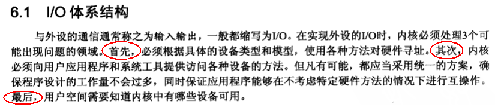
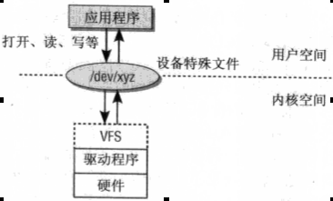
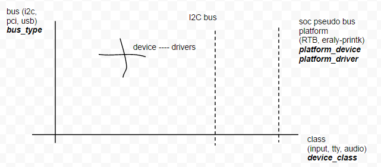

#IO体系结构概念

首先，什么是IO？看这个介绍：


外设和设备通过总线连接，包括系统总线（如PCI、ISA总线）和扩展总线（USB、SCSI）。

内核应该向应用程序提供统一的接口样式访问设备。Linux将各种设备在用户态抽象为不同的文件(字符设备、块设备、网络设备等)，应用程序可以read/write/ioctl控制设备。设备驱动程序在内核和设备之间提供适配。



设备文件有主设备号、从设备号。主设备号，供内核加载合适的驱动程序。多个设备可以共用一个主设备号。相同的驱动程序，也可以使用不同的设备总线。如两根不同的SATA总线，对应的主设备号不一样。

在嵌入式设备中，可以在启动脚本中使用mknod创建所有的设备文件，但对PC而言，由于支持热插拔，可能用到哪些设备是不确定的，设备号需要动态创建。udevd可以监听内核热插拔消息，然后在/dev下创建设备节点。需要注意，由于热插拔，所以/dev只需要保存在内存文件系统中即可。需要注意，不是所有的设备都在用户态有对应的设备节点。比如USB、SCSI总线。这种情况下需要使用到专用的系统调用函数。

由于历史原因，最初主设备号和从设备号各用8个bit表示，之后扩展主设备用12个bit，从设备号用20个bit。新的dev_t整数需要兼容以前。

根据CPU体系结构的不同，CPU对IO端口的编址方式有两种：
1. I/O映射方式（I/O-mapped）  
  典型地，如X86处理器为外设专门实现了一个单独的地址空间，称为"I/O地址空间"或者"I/O端口空间"，CPU通过专门的I/O指令（如X86的IN和OUT指令）来访问这一空间中的地址单元。
2. 内存映射方式（Memory-mapped）  
  RISC指令系统的CPU（如ARM、PowerPC等）通常只实现一个物理地址空间，外设I/O端口成为内存的一部分。此时，CPU可以象访问一个内存单元那样访问外设I/O端口，而不需要设立专门的外设I/O指令。  

在硬件层次上，I/O区域和内存区域没有概念区别。他们都通过地址总线和控制总线发送地址信号进行访问，再通过数据总线读写数据。他们的区别在操作系统的设计上，一种是使用I/O控制器对2^16个8bit地址的端口进行读写操作(outb)，另一种方法是将I/O端口映射到普通内存中（ioremap/iounmap）。但是，这两者在硬件实现上的差异对于软件来说是完全透明的，驱动程序开发人员可以将内存映射方式的I/O端口和外设内存统一看作是"I/O内存"资源。

#Linux驱动模型

首先，需要弄清楚class、bus、driver和device之间的关系。上图是对这一关系的简单描述。




##Platform总线
以keyreset按键的处理流程为例
```c
int keyreset_probe(struct platform_device *pdev)
    |-->state->pdev_child->dev.parent = &pdev->dev;   pdev_child是KEYCOMBO_NAME的platform_device
    |-->pdata_child->priv = state;  state是struct keyreset_state
    |-->platform_device_add_data(state->pdev_child, pdata_child, size);    pdata_child是struct keycombo_platform_data
    |-->platform_device_add(state->pdev_child);  添加的是keycombo的platform_device
int keycombo_probe(struct platform_device *pdev)
    |-->若pdev->dev.of_node存在，则从dt中解析数据
    |-->INIT_DELAYED_WORK(&state->key_down_work, do_key_down);
    |-->INIT_WORK(&state->key_up_work, do_key_up);
    |-->input_register_handler(&state->input_handler);
    |-->platform_set_drvdata(pdev, state);
```

#操作IO mem
[linux内存操作--ioremap和mmap学习笔记](http://blog.csdn.net/codectq/article/details/25658813)  
既然说到地址空间，就要明确地址空间的种类：物理地址、总线地址、虚拟地址。

1. 物理地址  
CPU地址总线传来的地址，由硬件电路控制其具体含义。物理地址中很大一部分是留给内存条中内存的，但也常被映射到其他存储器上（如显存、bios等）。在程序指令中的虚拟地址经过段映射和页面映射后，就生成了物理地址，这个物理地址被放到CPU的地址线上。
2. 总线地址  
总线的地址线或在地址周期上产生的信号。外设使用的是地址总线，cpu使用的是物理地址。
物理地址和总线地址之间的关系有系统设计决定的。在X86平台上，物理地址就是总线地址，这是因为它们共享相同的地址空间。在其他平台上，可能需要转换/映射。
3. 虚拟地址  
现代操作系统普遍采用虚拟内存管理（virtual memory management）机制，这需要MMU的支持。MMU通常是CPU的一部分，如果处理器没有MMU，或者有MMU但没有启用，CPU执行单元发出的内存地址将直接传到芯片引脚上，被内存芯片（物理内存）接收，这成为物理地址，如果处理器启用了MMU,CPU执行单元发出的内存地址将被MMU截获，从CPU到MMU的地址称为虚拟地址，而MMU将这个地址翻译成另一个地址发到CPU芯片的外部地址引脚上，也就是讲虚拟地址映射成物理地址。

linux中，进程的4GB内存分为用户空间和内核空间。用户空间分布为1~3GB剩下的1GB为内核空间。程序员只能使用虚拟地址。系统中每个进程有各自的私有用户控件（0~3GB），这个空间对系统中的其他进程是不可见的。

一般来说，在系统运行时，外设的I/O内存资源的物理地址是已知的，由硬件的设计决定。但是CPU通常并没有为这些已知的外设I/O内存资源的物理地址预定义虚拟地址范围，驱动程序并不能直接通过物理地址访问I/O内存资源，而必须将它们映射到核心虚地址空间内（通过页表），然后才能根据映射所得到的核心虚地址范围，通过访内指令访问这些I/O内存资源。

参考BCM63168芯片。I/O外设寄存器被CPU的BIU模块映射到kseg2地址空间，操作系统不参与。这个过程软件没有参与。如果需要将物理地址映射到虚拟地址，可以使用ioremap重新映射，然后再使用mmap映射到用户态。使用这种方式，可以将外设的控制寄存器、状态寄存器和数据空间映射到cpu的地址空间中。

强调，我们说的地址空间，都是cpu的地址空间，只是有的地址被映射到内存中，有的被映射到线卡中，或者一个网卡上。
```
#define REG_BASE 0xb0000000
#define GPIO_BASE (REG_BASE + 0x000000c0) /* gpio registers */
#define UART_BASE (REG_BASE + 0x00000180) /* uart registers */
```

##I/O内存
资源管理是I/O内存的分配方式。如下是在63168单板上的iomem映射图。Linux资源管理采用树状结构，根节点为iomem_resource。
```
# cat /proc/iomem
00000000-03ecdfff : System RAM
  00010000-003960af : Kernel code
  003960b0-004738df : Kernel data
10000200-10000383 : brcmnand
10002500-100025ff : ehci_hcd
10002600-100026ff : ohci_hcd
11000000-11efffff : bcm63xx pcie memory space
a0f00000-a0ffffff : bcm63xx pci memory space
```
可移植的驱动程序，应该实现用于访问I/O内存区域的函数，比如：
```
readb(addr), readw(addr), readl(addr),
writeb(addr)，writew(addr)，writel(addr)，
```
当我们经常读取外围设备的寄存器时，在readb或者writeb中,需要按照总线协议，将之转换为对设备的读写。比如SMI接口。

##I/O端口
I/O端口类似与I/O内存，而且可以通过这两种方式访问同一个设备，只是访问的函数接口不一样。I/O端口必须使用特殊的处理器命令访问。比如insw(port,addr,num)从端口port读取num个字节复制到普通地址空间的addr下
```
# cat /proc/ioports
a2000000-a200ffff : bcm63xx pci IO space
```

再查询63168的寄存器手册，可通过寄存器配置串口设备的波特率、停止位、中断及掩码等特性。

Ioremap将memory layout中reserve出来的memory映射到虚拟地址空间。
```
static void __iomem *__ioremap_caller(phys_addr_t phys_addr, size_t size,
                      pgprot_t prot, void *caller)
{   。。。
    if (WARN_ON(pfn_valid(__phys_to_pfn(phys_addr))))
        return NULL;
//调用memblock_is_memory检查pfn是否在memory中。也即不允许映射RAM
    area = get_vm_area_caller(size, VM_IOREMAP, caller);  获取虚拟地址area
    addr = (unsigned long)area->addr;  获取虚拟地址
    err = ioremap_page_range(addr, addr + size, phys_addr, prot);  将iomem按page映射到虚拟地址
    return (void __iomem *)(offset + addr);  算偏移，返回地址。
}
```
\_\_ioremap  
将一个IO地址空间映射到内核的虚拟地址空间上去，便于访问； 
```
void * __ioremap(unsigned long phys_addr, unsigned long size, unsigned long flags) 
```
* phys_addr：要映射的起始的IO地址； 
* size：要映射的空间的大小； 
* flags：要映射的IO空间的和权限有关的标志； 

**实现**：  
对要映射的IO地址空间进行判断，低PCI/ISA地址不需要重新映射，也不允许用户将IO地址空间映射到正在使用的RAM中，最后申请一 个 vm_area_struct结构，调用remap_area_pages填写页表，若填写过程不成功则释放申请的vm_area_struct空 间；

**意义**：  
比如isa设备和pci设备，或者是fb，硬件的跳线或者是物理连接方式决定了硬件上的内存影射到的cpu物理地址。 在内核访问这些地址必须分配给这段内存以虚拟地址,这正是\_\_ioremap的意义所在 ,需要注意的是,物理内存已经"存在"了,无需alloc page给这段地址了. 

为了使软件访问I/O内存,必须为设备分配虚拟地址.这就是ioremap的工作.这个函数专门用来为I/O内存区域分配虚拟地址(空间).对于直接映射的I/O地址ioremap不做任何事情。有了ioremap(和iounmap),设备就可以访问任何I/O内存空间,不论它是否直接映射到虚拟地址空间.但是,这些地址永远不能直接使用(指物理地址),而要用readb这种函数。

##用户态操作IO寄存器
示例：
```
fd = open("/dev/mem", O_RDWR | O_SYNC);
global_CPLD_BaseAddrVirtual = mmap(0, 0x1000, PROT_READ | PROT_WRITE, MAP_SHARED,  fd, 0xE9000000);
对于mmap映射的内存，需要使用munmap取消映射。
```
1. 首先在用户态打开/dev/mem，该文件为整个内存的虚拟地址空间。
1. 然后使用mmap将文件映射到用户态地址空间，方便直接操作内存，而不用read/write/seek等函数。但该操作需要root权限，不具备通用性。
    * 第一个参数为起始地址，
    * 最后一个参数为offset，两个组合在一起，可以得到希望待映射文件的起始地址。
    * 第二个参数为len，表示希望映射多大的地址范围。这个示例中，映射了一个Page。
    * 第三个参数为读写权限。第四个为共享权限。通过该方法也可以达到进程间通讯的目的。fd为该文件对应的描素符。

前面讲到，可以用ioremap将I/O内存映射到虚拟地址空间，然后用mmap访问。对于内核其他的物理地址，也可以实用mmap来映射。
方法是，使用__pa(virt_addr)获取物理地址，然后将物理地址作为offset，可以得到物理内存的偏移。


##字符设备的创建
创建一个字符设备的几个过程（以epon_stack_shell为例）：
```c
epon_chrdev_init
    |-->dev = MKDEV(epon_chrdev_major, 0); 根据主设备号生成设备标识dev_t。
    |-->register_chrdev_region(dev, 1, BCM_EPON_STACK_NAME); 为字符设备注册设备范围。比如这里的1，表示只允许有一个实例存在。
    |-->cdev_init(&epon_chrdev_cdev, &epon_core_fops); 初始化字符设备驱动结构体，包括将这个驱动加到kobject体系中。epon_core_fops定义与硬件通信的操作函数。包括open/read/write/ioctl/close等。
    |-->cdev_add(&epon_chrdev_cdev, dev, 1); 将字符设备驱动通过kobj_map添加到设备数据库。
打开一个文件的几个过程：
在/dev下找到需要打开的文件，如/dev/epon_stack_shell
    |-->通过内核文件系统，找到该设备文件对应的inode
        |-->根据设备文件的主设备号，调用kobject_lookup查询字符设备的数据库，返回与此驱动相关的kobject对象实例
            |-->根据kobject得到字符设备驱动对象cdev，然后调用cdev->f_op->open
    |-->设备初始化完成后，还需要将cdev和inode->i_cdev关联起来。

```


