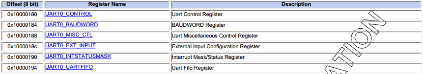

本节主要分析串口驱动流程及sysRQ魔键的代码流程。

---

##UART协议
UART是一种通用串行数据总线，用于异步通信。该总线双向通信，可以实现全双工传输和接收。工作原理是将传输数据的每个字符一位接一位地传输。CPU先把准备写入串行设备的数据放到UART的寄存器（临时内存块）中，再通过FIFO（First Input First Output，先入先出队列）传送到串行设备。传输过程中，将字符转化为比特，其中各位的意义如下：
* 起始位：先发出一个逻辑”0”的信号，表示传输字符的开始。
* 资料位：紧接着起始位之后。资料位的个数可以是4、5、6、7、8等，构成一个字符。通常采用ASCII码。从最低位开始传送，靠时钟定位。
* 奇偶校验位：资料位加上这一位后，使得“1”的位数应为偶数(偶校验)或奇数(奇校验)，以此来校验资料传送的正确性。
* 停止位：它是一个字符数据的结束标志。可以是1位、1.5位、2位的高电平。 由于数据是在传输线上定时的，并且每一个设备有其自己的时钟，很可能在通信中两台设备间出现了小小的不同步。因此停止位不仅仅是表示传输的结束，并且提供计算机校正时钟同步的机会。适用于停止位的位数越多，不同时钟同步的容忍程度越大，但是数据传输率同时也越慢。[3] 
* 空闲位：处于逻辑“1”状态，表示当前线路上没有资料传送。
* 波特率：是衡量资料传送速率的指标。表示每秒钟传送的符号数（symbol）。一个符号代表的信息量（比特数）与符号的阶数有关。例如资料传送速率为120字符/秒，传输使用256阶符号，每个符号代表8bit，则波特率就是120baud，比特率是120*8=960bit/s。这两者的概念很容易搞错。

发送逻辑对从发送FIFO 读取的数据执行“并→串”转换。控制逻辑输出起始位在先的串行位流，并且根据控制寄存器中已编程的配置，后面紧跟着数据位（注意：最低位 LSB 先输出）、奇偶校验位和停止位。

接收逻辑 在检测到一个有效的起始脉冲后，接收逻辑对接收到的位流执行“串→并”转换。此外还会对溢出错误、奇偶校验错误、帧错误和线中止（line-break）错误进行检测，并将检测到的状态附加到被写入接收FIFO 的数据中。

波特率除数（baud-rate divisor）是一个22 位数，它由16 位整数和6 位小数组成。波特率发生器使用这两个值组成的数字来决定位周期。通过带有小数波特率的除法器，在足够高的系统时钟速率下，UART 可以产生所有标准的波特率，而误差很小。

Program to determine Tx and Rx Baudrate. The 32*Baud frequency is determined by the following formula:
```
Fbaud32 = Fperiph * 1/(1+BaudWord) where Fperiph = 50 MHz.
```

##BCM63xx UART实例
BCM63xx UART寄存器


有意思，发现63168芯片居然有32个中断寄存器的掩码，但是cpu通常没有办法支持这么多的中断。

bcm63xx_tx_chars(port)  --> 


```
cd /proc/tty/driver
# cat bcmserial
serinfo:1.0 driver revision:
0: uart:BCM63XX mmio:0xB0000180 irq:13 tx:18162200 rx:109 brk:4 RTS|DTR
1: uart:BCM63XX mmio:0xB00001A0 irq:42 tx:0 rx:0
# cat usbserial
usbserinfo:1.0 driver:2.0
```

代码：
bcmdrivers\opensource\char\serial\impl1\bcm63xx_cons.c

