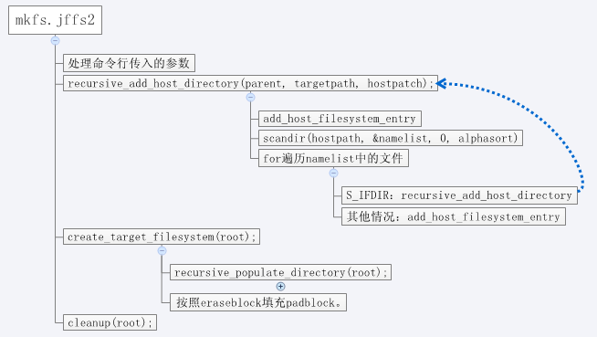

JFFS2文件系统
从mkfs.jffs2中体会JFFS2存储的静态布局, 在H168N中，制作jffs2文件系统的命令为：
```
mkfs.jffs2 -b -p -n -e 131072 -r targets/H168N/fs -o targets/H168N/rootfs128kb.img -N hostTools/nocomprlist
```
-p 在生成的rootfs128kb.img文件末尾填充0x00，使文件大小按照erase_block_size对齐。0x00是JFFS2_DIRTY_BITMASK，而如果使用0xFF填充，则在内核启动时出现“Empty flash at 0xXXXXXXXX ends at 0xYYYYYYYY”这样的打印。  
-b, -l字节序是大端还是小端  
-n 不要在erase block最前面加cleanmarker。Cleanmarker用于标记block是否完成了擦除操作。  
-r  输入文件夹  
-o 输出文件  
-N 不压缩的文件  
-i 指明一个jffs2镜像文件。使用parse_image遍历该文件，找最大的inode编号，并作为之后创建target image时的起始inode编号。之后的regular、symlink、pipe、special file的ino都在此基础上累加。也即，-i指定一个文件，作为image的基础文件。  
-f 为方便回归测试，将所有文件的时间都修改为0  
-q 类似与squash 文件，所有文件的权限和拥有者都为root 
-U 所有文件的拥有者都为root  
-P 所有文件的权限类似于sqush，为root所拥有。  
 
下图是mkfs.jffs2的代码执行流程。


recursive_add_host_directory遍历整个源文件夹，将待制作镜像的文件保存在一个名为root的filesystem_entry类型变量中。filesystem_entry可以完整地保存源文件夹的树结构、名称、权限等。用于保证文件夹的树形结构的字段为parent、prev、next、files。
```c
struct filesystem_entry {
       char *name;                                basename，文件名
       char *path;                                 /* Path of this directory (think dirname) */
       char *fullname;                           target上完整文件名
       char *hostname;                          host上完整文件名
       uint32_t ino;                        在JFFS镜像中，该文件的inode编号
       struct stat sb;                        存储该文件的权限和所有者。可指定，或者继承自host文件。
       char *link;                                  目标链接
       struct filesystem_entry *parent;     父节点
       struct filesystem_entry *prev; 相同目录下的兄弟节点，首节点为files
       struct filesystem_entry *next;       相同目录下的兄弟节点，首节点为files
       struct filesystem_entry *files;       对于目录，该字段才有意义。它指向它的第一个子节点。
       struct rb_node hardlink_rb; 
};
```
 
下图是创建目标文件系统时的流程。注意这个流程中有两个while循环，第一个循环遍历dir->files，将其中所有的文件节点到目标文件系统，第二个循环遍历dir->files，检查该目录下所有文件，如果该文件是一个目录，则递归调用recursive_populate_director(root)，将该目录下所有文件节点都写如到目标文件系统中。


在该流程中，有4个写文件到目标文件系统的函数，他们分别是：  
write_dirent(e)，写入DIRENT类型的inode，用于保存文件名。  
write_pipe(e)，写入INODE类型的inode，data为空，设置uid、mode、time信息，以及pino.也即文件和它的所在的目录仅仅这里通过这里的pino关联。目录并不保存它所包含的文件列表。  

考虑构造目标文件系统的顺序，先写入目录文件，再写入该目录中子文件。也即在写入目录文件时，是不知道它下面所有子节点的inode编号的。而写入子文件时，其父目录的inode编号已经获取到。否则，如果需要在目录inode中保存其所有子文件的编号，会导致目录文件数据inode的大小不可预估。除非在写文件系统之前，遍历整个源文件，提前赋值inode。
write_special_file(e)，写入特殊文件,此处省略  
write_regular_file(e)，写入常规文件，类型为INODE。  

       此外，需要注意到这四个写入目标文件系统的函数，在实际写之前，都会检查剩余空间是否够存储一个inode。所以有可能出现一个文件的DIRENT inode和INODE inode不在一个block的情况。在遍历jffs2镜像的时候需要注意该现象。

       注意上图中write_pipe和write_regular_file两个函数，都包含write_dirent和写数据inode两个部分。但是对ino全局变量的递增操作却只做了一次！表明文件系统的任意一个文件，虽然它可能有多个inode实例，但是这些实例的inode编号却是共享的。
 
文件的stat状态信息：
```c
struct stat {
   dev_t     st_dev;     /* ID of device containing file */
   ino_t     st_ino;     /* inode number */
   mode_t    st_mode;    /* protection */
   nlink_t   st_nlink;   /* number of hard links */
   uid_t     st_uid;     /* user ID of owner */
   gid_t     st_gid;     /* group ID of owner */
   dev_t     st_rdev;    /* device ID (if special file) */
   off_t     st_size;    /* total size, in bytes */
   blksize_t st_blksize; /* blocksize for filesystem I/O */
   blkcnt_t  st_blocks;  /* number of blocks allocated */
   time_t    st_atime;   /* time of last access */
   time_t    st_mtime;   /* time of last modification */
   time_t    st_ctime;   /* time of last status change */
};
```
