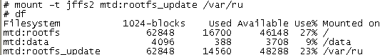

##信息查看接口
1. 字符设备/dev/mtd*，可通过ioctl、I/O访问、erase、mark bbt操作原始flash。
2. 模拟出来的块设备/dev/mtdblock*

3. sysfs  

4. /proc/mtd  

5. df  


这里将flash模拟为块设备，可以按照块设备的方式去mount。

mount -t jffs /dev/mtdblock1 /var/ru
这条命令也有类似的mount的效果。

##数据结构
include/linux/mtd/mtd.h
```
struct mtd_info
struct nand_ecclayout 
struct mtd_oob_ops
struct erase_info
```

部分函数接口：
```
int mtd_erase(struct mtd_info *mtd, struct erase_info *instr);
int mtd_read(struct mtd_info *mtd, loff_t from, size_t len, size_t *retlen,  u_char *buf);
int mtd_write(struct mtd_info *mtd, loff_t to, size_t len, size_t *retlen,  const u_char *buf);
```

###在linux中使用mtd设备
[Working with MTD Devices](http://www.opensourceforu.com/2012/01/working-with-mtd-devices/)

##测试工具
需要打开内核编译选项"Device Drivers" -> "Memory Technology Device (MTD) support" -> "MTD tests support"

用户态的工具包括mtd_speedtest, mtd_readtest等。git://git.infradead.org/users/ahunter/nand-tests.git

#FLASH层面

##Nand Flash
1. 启动方式  
一般地，无法从nand flash启动，只能从ROM上启动。但有的SoC芯片可以在启动的时候读取Nand Flash的第一个page，然后启动。可以在这个page中初始化SDRAM，然后继续读取Nand Flash上随后的块。也就是启动被分为了initial和secondary两步。

2. nand flash只能按照8bit或16bit的宽度来读取。如果说一个flash支持32bit宽度，一定是在内部使用控制器将两个flash并在一起。

3. 使用nand flash模拟工具nandsim，方便调试mtd。详情参考

4. NAND FLASH的管理方式
以三星FLASH为例，一片Nand flash为一个设备(device)，1 (Device) = xxxx (Blocks)，1 (Block) = xxxx (Pages)，1(Page) =528 (Bytes) = 数据块大小(512Bytes) + OOB 块大小(16Bytes，除OOB第六字节外，通常至少把OOB的前3个字节存放Nand Flash硬件ECC码)。如果NAND物理上是2K的Page，则每个Page分配64字节的OOB。（为16字节的4倍。也即每512字节需要有16字节的OOB）

5. 坏块检测方式：ECC
ECC，Error Checking and Correcting。ECC一般每256字节原始数据生成3字节ECC校验数据，这三字节共24比特分成两部分：6比特的列校验和16比特的行校验，多余的两个比特置1。（512生成两组ECC，共6字节） 数据位每增加一倍，ECC只增加一位检验位，也就是说当数据位为16位时ECC位为6位，32位时ECC位为7位，数据位为64位时ECC位为8位，依此类推，数据位每增加一倍，ECC位只增加一位。

6. 两种坏块管理方式
1. check一下第一页的spare area的第6个byte是否是0xff，如果是就证明这是一个好块，可以擦除；如果是非0xff，那么就不能擦除，以免将坏块标记擦掉。
1. BBT，用单独的块记录坏块信息。这个块有可能是第一个块，或者最后一个块。

7. nand flash下烧结版本的制作

#MTD层面
要了解mtd设备，必须先了解flash的特点。闪存，无论是NOR flash还是NAND flash，在干净状态下所有数据bit位都是1，在写操作时只能将1写为0，而不能把0写成1。换句话说，所有的块只能写一次，如果要再写，需要将对应的块erase一遍，将所有数据位全部清为1。flash能够支持的erase操作的次数是有限制的，通常NOR flash在十万数量级，NAND flash在百万数量级，而硬盘块设备写的次数基本没有限制。

NOR flash 读/写操作的基本单位是字节；而 NAND flash 又把擦写块分成页（page），页是写操作的基本单位，一般一个页的大小是 512 或 2K 个字节。也即NOR flash是线性存储器，而NAND flash为非线性存储方式，统一的8位数据/地址＋3位控制信号。

**思路1**，由linux内核提供适配层。将底层的闪存模拟成一个具有 512字节扇区大小的标准块设备(block device)。对于文件系统来说，就像工作在一个普通的块设备上一样，没有任何的差别。

基于闪存写第二次时需要先erase的特点，如果要修改一个page，直观的做法是读->修改->erase->回写等步骤。但这样负载集中，可能损坏flash。FTL需要实现磨损平衡，减少闪存写操作时的数据丢失。所以较好的方法是，读->修改->写新的page->修改映射关系。这样做可以避免频繁修改一个page，缺点是flash上会存在很多垃圾page，需要做好垃圾回收，另外，FTL需要理解VFS的语义。

针对这种情况，出现一些专门针对flash的文件系统，jffs、squashfs。

**思路2**，在flash内部增加一个控制器，将nand flash模拟为块设备。这种flash被成为eMMC。（MMC, eMMC, SD, CompactFlash，etc.）
在android手机MX3上查看，flash没有用mtd管理。

##mtd驱动
mtd驱动包括mtd和mtdblock两个主要部分。

mtd_info主要负责和flash打交道，处理ecc、read、write等函数。用户态可通过/dev/mtd*字符设备来配置mtd。mtd_part为flash的分区。

mtd_blktrans_dev负责和上层block模块打交道，每个分区模拟为块设备，并向block模块提供request_queue完成实际的读写操作。
```c
register_mtd_blktrans(&mtdblock_tr)  mtdblock_tr是可读写mtd块设备的操作对象。还支持对只读块设备。
    |-->register_blkdev(tr->major, tr->name)  注册块设备主设备号。tr是传入的mtdblock_tr对象。名称为mtdblock
    |-->INIT_LIST_HEAD(&tr->devs)  初始化这一类型的所有mtd_blktrans_dev的链表。
    |-->list_add(&tr->list, &blktrans_majors)  将所有类型的blk放到blktrans_majors全局列表中。在63168中，只有一类mtd_block。
    |-->mtd_for_each_device(mtd) tr->add_mtd(tr, mtd); 即add_mtd_blktrans_dev
         |-->mtd->backing_dev_info 根据mtd类型，设置backing_dev_info，可用于mmap mtd设备。
         |-->idr_get_new(&mtd_idr, mtd, &i) 为这个mtd设备申请一个idr。
         |-->设置mtd的各种属性，包括erasesize_mask、name、dev.class等。
         |-->device_register(&mtd->dev)  向驱动框架注册设备
         |-->gd = alloc_disk(1 << tr->part_bits); add_disk(gd);   分配一个disk，block模块可使用mtdblock作为其driverdev。
         |-->new->rq = blk_init_queue(mtd_blktrans_request, &new->queue_lock);  设置disk的request_queue
         |-->new->thread = kthread_run(mtd_blktrans_thread, new, "%s%d", tr->name, new->mtd->index);  为每个mtdblock设备注册一个线程处理读写request
```
vfs的open函数负责打开或创建文件，级文件级别的打开，需要和file、inode、dentry等数据结构打交道。
mtdtrans_dev的open函数，负责为block模块模拟一个mtd块设备，和设备号、request队列、sync函数等打交道。

##mtd编程
* 应用编程，使用mtd-user.h头文件，可使用ioctl(fd, MEMGETINFO, &mtd_info)得到文件mtd设备的信息，比如块的大小。
* 内核编程，使用get_mtd_device获取mtd_info，调用mtd_info->read/write读写flash。

由于erase耗时，所以使用wait_queue配合erase callback。
```c
#include <linux/sched.h>

void erase_partition(struct mtd_info *mtd_info) {
    unsigned int start;
    for(start = 0; start < mtd_info->size; start += mtd_info->erasesize) 
        erase_sector(mtd_info, start, mtd_info->erasesize);
}
 
void erase_sector(struct mtd_info *mtd_info, unsigned int start, unsigned int len) 

{
    int ret;
    struct erase_info ei = {0};
    wait_queue_head_t waitq;
    DECLARE_WAITQUEUE(wait, current);
    
    init_waitqueue_head(&waitq);
    ei.addr = start;
    ei.len = mtd_info->erasesize;
    ei.mtd = mtd_info;
    ei.callback = erase_callback;
    ei.priv = (unsigned long)&waitq;
    ret = mtd_info->erase(mtd_info, &ei);
    if(!ret)     {
        set_current_state(TASK_UNINTERRUPTIBLE);
        add_wait_queue(&waitq, &wait);
        if (ei.state != MTD_ERASE_DONE && ei.state != MTD_ERASE_FAILED)
            schedule();
        remove_wait_queue(&waitq, &wait);
        set_current_state(TASK_RUNNING);
 
        ret = (ei.state == MTD_ERASE_FAILED)?-EIO:0;
    }
}
 
void erase_callback (struct erase_info *instr) {
    wake_up((wait_queue_head_t *)instr->priv);
}
```
##JFFS2
缺点：
1. 不支持mmap操作，无法从用户态直接映射flash的文件到用户态。（yaff支持该功能，所以可在android上使用。）


##YAFFS
缺点：
1.  不支持多线程，在双核系统上可能成为一个瓶颈。（基于此原因，yaffs从android2.3开始，也被android抛弃。）

