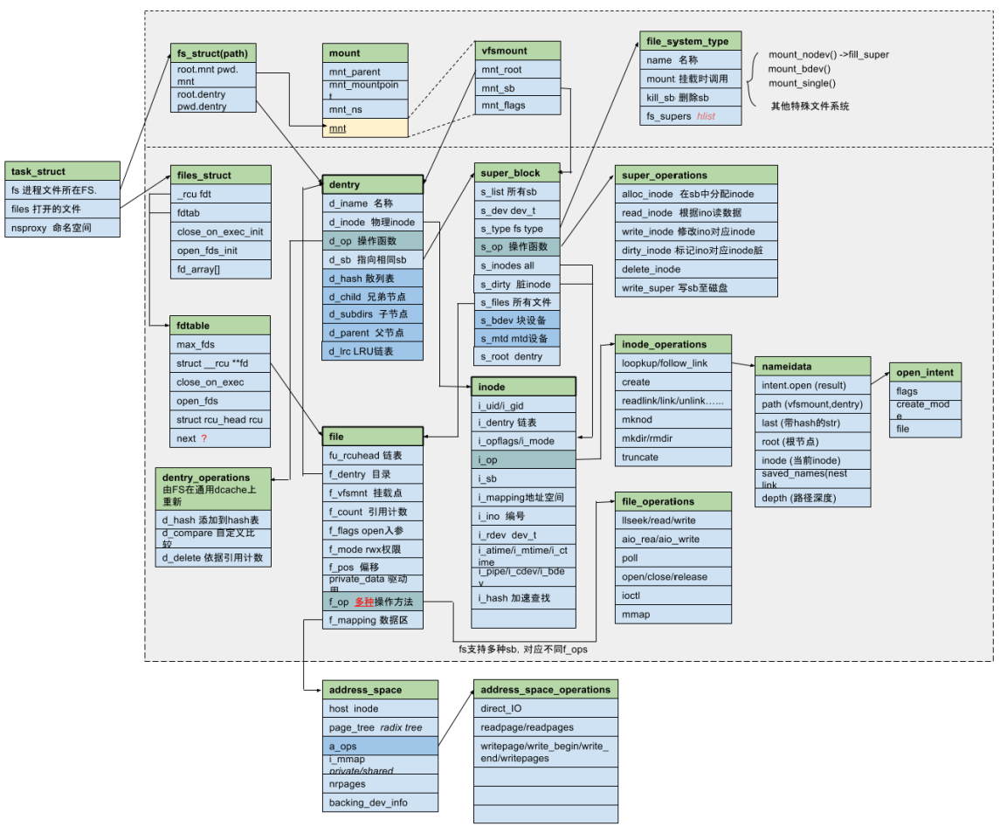

主要源码文件的功能介绍
* namei.c  使用open打开的文件，文件名称相关的接口。比如路径搜索，权限校验，链接搜索。包括根据do_filp_open
* open.c  定义了如open、close、chroot、chdir、fchmod等很多系统调用的入口函数。
* read_write.c   read/write/lseek/readv（一次读多个数据）/writev/sendfile 等很多实际操作文件的接口。
* super.c  文件系统超级块
* dcache.c
* inode.c
* file.c

主要函数：
* do_filp_open  指定路径，返回file对象。也即，完成实际的打开文件的操作。

**inode和file结构体的区别**
* inode是数据文件在内存中的抽象，可分为描述文件状态的元数据与保存实际文件内容这两种inode。
* file结构体是文件在内核态的入口，可以用来描述socket、数据文件、proc、设备文件等。其slab名称为filp。

##文件系统基础及调试方法
文件系统的挂载
```
mount -t ext4 /dev/sdb /home/src   挂载/dev/sdb硬盘到/home/src目录下
dd if=/dev/zero of=first.file bs=1M count=1     创建一个回环设备，大小为1M。回环设备的分区，使用losetup命令。 
mkfs.ext4 first.file                                                  在这个回环设备上创建文件系统。
mount -o loop first.file /home/liu/src/loop        挂载回环设备。
```
通过上面的方法，方便调试文件系统。

```
# cat /proc/filesystems
nodev sysfs
nodev rootfs
nodev bdev
nodev proc
nodev tmpfs
nodev debugfs
nodev sockfs
nodev usbfs
nodev pipefs
nodev anon_inodefs
nodev devpts
        ext3
        squashfs
nodev ramfs
        vfat
nodev jffs2
        fuseblk
nodev fuse
nodev fusectl
nodev mtd_inodefs
nodev ubifs
```

##文件系统的数据结构
vfsmount中仅包含最常用的两个字段dentry和相应的super_block。其他不常用的字段，放在mount数据结构中。可以用container_of宏找到相应的mount结构。


*struct file_struct*  
该数据结构用struct fdtable记录进程的所有fd。有趣的是，它有两个fdtable实例，一个是__rcu fdt指针，一个是fdtab对象。初始时，file_struct对象中的fdt指针指向其内部的fdtable。在对fdtable进行扩展的时候，fdt指针会指向一个新的指针。使用了rcu技术，实现了无锁读写。所以1）任何时候需要获取进程的fdt，都需要通过files_fdtable(current->files)这样的宏来完成，2）使用rcu_read_lock/rcu_read_unlock保护对fdt的读操作，3）持有files->file_lock保护写操作。更详细参考Documentation/filesystems/files.txt

*struct inode* 
file并没有直接记录inode。

*struct super_block*  
s_root  dentry，如果为NULL，表示这个文件系统从用户态看不到。

##文件系统的主要流程
###挂载文件系统mount
要挂载文件系统，首先register_filesystem(&ext2_fs_type) 将文件系统类型注册到全局链表file_systems，可通过/proc/filesystem中查看所有注册的文件系统。mnt_cache
```c
sys_mount  mount的系统调用，包括5个参数：dev_name, dir_name, type, flag, data。
    |-->将用户态的装载选项拷贝到内核中。dir_name从names_cachep中分配，dev_name使用kmalloc分配内存，data使用__get_free_page分配内存。
    |-->do_mount  该函数实际是一个多路分发装置，需要根据flag，调用实际的mount函数。这里将考虑没有任何参数的do_new_mount。
        |-->kern_path(dir_name, LOOKUP_FOLLOW, &path)   调用do_path_lookup，查找dir_name对应的dentry和vfsmount信息。LOOKUP_FOLLOW表示follow link.
        |-->do_new_mount  创建一个挂载点，并将之添加到相应的namespace中。
             |-->do_kern_mount  找到相应的file_system_type，调用其mount函数挂载文件系统
                  |-->type = get_fs_type(fstype);  从全局链表file_systems中找到相应的fstype
                  |-->vfs_kern_mount(type, flags, name, data)  为新的文件系统创建挂载点vfsmount
                       |->alloc_vfsmnt(name)  分配一个mount结构的对象
                       |-->mount_fs(type, flags, name, data)  使用type对应文件系统的mount函数，挂载文件系统，并返回root的dentry
                       |-->配置该挂载点相关的root dentry、super_block、挂载点的dentry和super_block信息
             |-->do_add_mount(real_mount(mnt), path, mnt_flags)  第一个参数，根据vfsmout找到对应的mount。将挂载点添加到graft_tree下。
                  |-->防止重复装载
                       |-->graft_tree(newmnt, path) 
                            |-->attach_recursive_mnt(mnt, path, NULL)
```
使用fill_super来注册  
static int jffs2_fill_super(struct super_block *sb, void *data, int silent)
fat32的exfat_fill_super，exfat_sops  
fuse的fuse_super_operations  

###打开文件  
打开文件，包括分配fd、inode、dentry，path搜索。
```c
sys_open  从当前目录开始搜索文件。另外openat系统调用相对于一个目录文件描述符打开文件
    |-->force_o_largefile  如果不是32位系统，即64位系统上，默认将O_LARGEFILE选项加上。在支持大文件的系统调用时，off64_t做lseek。需要使用开启了_LARGEFILE64_SOURCE的工具链。CPE的USB支持NTFS时，需要开启。
    |-->do_sys_open(AT_FDCWD, filename, flags, mode);  相对task_struct中记录的pwd path打开文件。flag包括O_CREAT|O_CLOEXEC|O_APPEND|O_DIRECT等。mode表示rwx权限标志位。
         |-->getname(filename)  从用户态拷贝文件名。参考sys_mount
         |-->get_unused_fd_flags(flags)  从当前进程的fd_array中分配一个未使用的fd
         |-->do_filp_open(dfd, tmp, &op, lookup)  -->filp = path_openat(dfd, pathname, &nd, op, flags | LOOKUP_RCU);   do_filp_open是path_openat的包装函数
              |-->error = path_init(dfd, pathname, flags | LOOKUP_PARENT, nd, &base);    设置nd的depth、flag、path、inode、root.mnt等参数
              |-->error = link_path_walk(pathname, nd)    解析路径名称，将dentry放入到nd中。
                   |-->for循环，查pathname的各个部分，walk_component(nd, &next, &this, type, LOOKUP_FOLLOW) 
                        |-->path_to_nameidata(path, nd)  将path的dentry存到nd中。
              |-->filp = do_last(nd, &path, op, pathname)
                   |-->dentry = lookup_hash(nd)
                        |-->dentry = lookup_dcache(name, base, nd, &need_lookup)   查询dcache中缓存的dentry。
                        |-->lookup_real(base->d_inode, dentry, nd)
                             |-->dir->i_op->lookup(dir, dentry, nd)  调用root节点的inode->loopup函数查找dentry
                   |-->path_to_nameidata(path, nd)
                   |-->filp = nameidata_to_filp(nd)
              |-->follow_link(&link, nd, &cookie);    由于硬链接的inode
         |-->fd_install(fd, f);   将file安装到进程的fdtable中。
```

###读写文件
```c
sys_read  
    |-->file = fget_light(fd, &fput_needed)  根据fd找到对应的filp
    |-->vfs_read(file, buf, count, &pos)  根据当前pos，从file中pos起始位置读取count个字节到buf中。之后更新pos。
         |-->各种权限检查
         |-->file->f_op->read(file, buf, count, pos)  调用具体文件系统的read函数执行读操作。
              |-->while循环中generic_file_aio_read(filp, iocb, iov, nr_segs, pos)   使用page cache的文件系统都会使用调用该函数
    |-->fput_light(file, fput_needed)  释放file
```
在读写文件时，将会使用到VFS提供的标准函数，这些函数大都相同。比如同步read，将实际读取操作委托给异步aio_read。如果数据块已知，则先查询页缓存。如果数据并为保存，则向相应的块设备发送读请求。异步操作不是对文件句柄执行，而是对I/O控制块执行。

每种文件系统都有自己的address_space_operations，属于块层的范畴。
```
linux-3.4rt/fs/ext2/inode.c:const struct address_space_operations ext2_aops
linux-3.4rt/fs/jffs2/file.c:const struct address_space_operations jffs2_file_address_operations
```

##proc fs
fs operation
```c
static const struct file_operations meminfo_proc_fops = {
 .open = meminfo_proc_open,
 .read_write = seq_read,            方便顺序读取的函数seq_read(struct file *file, char __user *buf, size_t size, loff_t *ppos)。正常情况下，一次只能读一个page。
 .llseek = seq_lseek,
 .release= single_release,
};
```
创建proc文件
```
proc_create("meminfo", 0, NULL, &meminfo_proc_fops);  每个proc文件都有自己的file_operations
    |-->proc_create_data(name, mode, parent, proc_fops, NULL)  创建proc_dir_entry
        |-->pde = __proc_create(&parent, name, mode, nlink)
        |-->proc_register(parent, pde)
```
注册proc文件系统
```
static struct file_system_type proc_fs_type = {
 .namei = "proc",
 .mount = proc_mount,
 .kill_sb= proc_kill_sb,
};
```
挂载proc文件系统
```
proc_mount(fs_type, flags, dev_name, data)  data指针传递文件系统挂载的namespace
    |-->如果MS_KERNMOUNT，则pid_namespace即data，否则为current->nsproxy->pid_ns，而data则记录挂载选项。
    |-->sb = sget(fs_type, proc_test_super, proc_set_super, ns)  查找并创建super block
    |-->proc_fill_super(sb) 如果sb不是root
    |-->return dget(sb->s_root)  返回dentry
```

