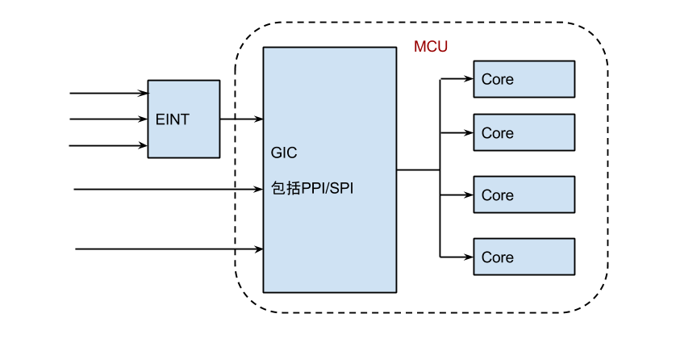

摘要：  
本文介绍mtk的MCU中的gic部分以及eint芯片。

---

#概念
gic， irqchip

#irqchip
irqchip是irq controller芯片。由于cpu外设众多，需要支持几百上千个中断类型，不可能都直接连到cpu上，需要controller充当路由器，汇总外设中断请求，并向cpu core分发。

在MT6753中，为mt-gic，芯片为GIC400，内置在cpu内部。

```
IRQCHIP_DECLARE(mt_gic, "mtk,mt-gic", mt_gic_of_init);  
```

声明一个irqchip，初始化函数为mt_gic_of_init。链接器会将所有的irqchip放在一起，数组名称为__irqchip_begin，在irqchip.c中遍历这个数组，初始化所有的irqchip。

#EINT
EINT用于芯片外中断源，包括pmic，tpd，它工作在GIC和外部器件之间，汇聚中断请求，发送单个中断到GIC。比如在MT6753中，EINT连接到GIC的185号中断上。



外部中断控制器处理所有外部单元发送到AP MCU的信号，支持231个外部中断。IRQ信号包括eint_irq或者eint_direct_irq。Irq控制器包括去抖动，极性（Electrical polarity (positive and negative)），边缘对齐/中间对齐等模块。EINTC模块的去抖动模块始终为32.75KHZ，所以一个中断信号从eint_bus进入到以eint_irq方式出去的时延为30.52μs。

##EINT模块包含的寄存器
* Status寄存器：为1时表示对应的外部中断有pending。该status寄存器会根据MASK寄存器决定是否产生中断，如果mask为0，将无法产生中断。而EINT_STA_RAW中记录未经过mask处理的原始status。
* ACK寄存器： 为1表示确认相应的外部中断。该标志位由AP MCU给出，表示CPU开始处理该中断。如果没有ACK，则该中断不应该再触发INTR。ACK可以由中断处理例程，也可以由延时的软中断函数给定。
* MASK寄存器：对应的中断能否接收。当mask为0时，则相应的中断无法发送到AP MCU. 
* MASK_SET寄存器：设置相应外部寄存器的MASK。从字面意思看，
* MASK_SET寄存器用于写，而MASK寄存器用于读。读和写是分离的。
* MASK_CLR寄存器，清除相应的mask。
* Sensitivity寄存器，包括EINT_SENS, EINT_SET, EINT_CLR。
* Soft interrupt寄存器，包括EINT_SOFT, EINT_SOFT_SET, EINT_SOFT_CLR.
* Polarity寄存器，包括EINT_POL，EINT_POL_SET, EINT_POL_CLR.
* Domain寄存器，包括EINT_DoEN。当中断相应bit位设置位1时，在domain 0中使能相应的软件外部中断。
* De-bounce寄存器，设置抖动时延，包括EINT_DBNC_3, EINT_DBNC_SET_3, EINT_DBNC_CLR_3

###初始化代码
```c
EINT_IRQ_BASE = get_supported_irq_num();
irq_base = irq_alloc_descs(EINT_IRQ_BASE, EINT_IRQ_BASE, EINT_MAX_CHANNEL, numa_node_id());

    for (i = 0 ; i < EINT_MAX_CHANNEL; i++) {
            irq_set_chip_and_handler(i + EINT_IRQ_BASE, &mt_irq_eint,
                                     handle_level_irq);
            set_irq_flags(i + EINT_IRQ_BASE, IRQF_VALID);
    }    

    domain = irq_domain_add_legacy(node, EINT_MAX_CHANNEL, EINT_IRQ_BASE, 0,
                                &mt_eint_domain_simple_ops, NULL);

    irq_set_chained_handler(irq, (irq_flow_handler_t)mt_eint_demux);
```

