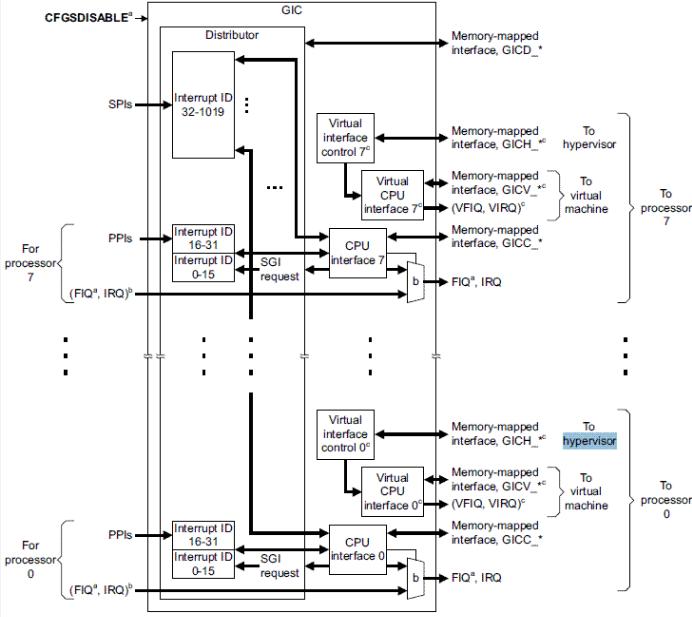

摘要：  
本文大致介绍irq相关的调度，包括软中断，tasklet，工作队列。详细的代码流程分析，需要参考具体的模块。

---
#中断概况
外设 -> irqchip  -> irq  -> irqhandle -> softirq


#中断处理流程
外设要和cpu进行通信。这种通信有两种模式，一种是cpu主动去读写外设，另外一种是外设主动通知cpu。第二种通信方式基于中断来实现。中断的来源，可以是SoC的外部器件，比如wifi/emmc/watchdog器件，也可以是另外一个cpu core。

##异常从中断返回
1. 因为流水线技术，从处理器的角度，当前正在执行的指令与PC的值并不相同。PC的值是当前正在执行的指令+8。
2. 异常发生时，处理器会讲PC-4保存到LR寄存器中，也就是当前指令的下一条指令。
3. 不同异常，返回的地址会不一样
	* 未定义指令中断，因为PC尚未更新，所以为当前正在执行的非法指令+8。
	* 处理器在执行当前指令后，检查是否有IRQ或FIQ发生。需要返回LR-4继续执行下一条指令。根据《ARM体系结构与编程》，page269描述，此时PC已经更新，为当前指令+12，看不太明白。
	* 指令预取中止异常，指令已取，PC未更新，需要返回当前指令继续执行，为LR-4
	* 数据预取中止异常，指令已取，PC已更新，需要返回当前指令继续执行。为LR-8

#中断相关的调度
##概念
软中断、tasklet和工作队列并不是Linux内核中一直存在的机制，而是由更早版本的内核中的“下半部”（bottom half）演变而来。下半部的机制实际上包括五种，但2.6版本的内核中，下半部和任务队列的函数都消失了，只剩下了前三者。本文重点在于介绍这三者之间的关系。（函数细节将不会在本文中出现，可以参考文献，点这里）

###上半部和下半部的区别
上半部指的是中断处理程序，下半部则指的是一些虽然与中断有相关性但是可以延后执行的任务。举个例子：在网络传输中，网卡接收到数据包这个事件不一定需要马上被处理，适合用下半部去实现；但是用户敲击键盘这样的事件就必须马上被响应，应该用中断实现。

两者的主要区别在于：中断不能被相同类型的中断打断，而下半部依然可以被中断打断；中断对于时间非常敏感，而下半部基本上都是一些可以延迟的工作。由于二者的这种区别，所以对于一个工作是放在上半部还是放在下半部去执行，可以参考下面四条：
1. 如果一个任务对时间非常敏感，将其放在中断处理程序中执行。
2. 如果一个任务和硬件相关，将其放在中断处理程序中执行。
3. 如果一个任务要保证不被其他中断（特别是相同的中断）打断，将其放在中断处理程序中执行。
4. 其他所有任务，考虑放在下半部去执行。

##为什么要使用软中断？
软中断作为下半部机制的代表，是随着SMP（share memory processor）的出现应运而生的，它也是tasklet实现的基础（tasklet实际上只是在软中断的基础上添加了一定的机制）。软中断一般是“可延迟函数”的总称，有时候也包括了tasklet（请读者在遇到的时候根据上下文推断是否包含tasklet）。它的出现就是因为要满足上面所提出的上半部和下半部的区别，使得对时间不敏感的任务延后执行，而且可以在多个CPU上并行执行，使得总的系统效率可以更高。它的特性包括：
1. 产生后并不是马上可以执行，必须要等待内核的调度才能执行。软中断不能被自己打断，只能被硬件中断打断（上半部）。
2. 可以并发运行在多个CPU上（即使同一类型的也可以）。所以软中断必须设计为可重入的函数（允许多个CPU同时操作），因此也需要使用自旋锁来保护其数据结构。

##为什么要使用tasklet？（tasklet和软中断的区别）
由于软中断必须使用可重入函数，这就导致设计上的复杂度变高，作为设备驱动程序的开发者来说，增加了负担。而如果某种应用并不需要在多个CPU上并行执行，那么软中断其实是没有必要的。因此诞生了弥补以上两个要求的tasklet。它具有以下特性：
1. 一种特定类型的tasklet只能运行在一个CPU上，不能并行，只能串行执行。
1. 多个不同类型的tasklet可以并行在多个CPU上。
1. 软中断是静态分配的，在内核编译好之后，就不能改变。但tasklet就灵活许多，可以在运行时改变（比如添加模块时）。

tasklet是在两种软中断类型的基础上实现的，但是由于其特殊的实现机制（将在4.3节详细介绍），所以具有了这样不同于软中断的特性。而由于这种特性，所以降低了设备驱动程序开发者的负担，因此如果不需要软中断的并行特性，tasklet就是最好的选择。

一般来说，将一些可以很快执行的小任务用tasklet来实现。小任务判断标准。

##可延迟函数（软中断及tasklet）的使用
一般而言，在可延迟函数上可以执行四种操作：初始化/激活/执行/屏蔽。屏蔽我们这里不再叙述，前三个则比较重要。下面将软中断和tasklet的三个步骤分别进行对比介绍。

###初始化
初始化是指在可延迟函数准备就绪之前所做的所有工作。一般包括两个大步骤：首先是向内核声明这个可延迟函数，以备内核在需要的时候调用；然后就是调用相应的初始化函数，用函数指针等初始化相应的描述符。如果是软中断则在内核初始化时进行，其描述符定义如下：

```c
  struct softirq_action
          {
                   void (*action)(struct softirq_action *);
                   void*data;
          };
```
在\kernel\softirq.c文件中包括了32个描述符的数组static struct softirq_action softirq_vec[32]；但实际上只有前6个已经被内核注册使用（包括tasklet使用的HI_SOFTIRQ/TASKLET_SOFTIRQ和网络协议栈使用的NET_TX_SOFTIRQ/NET_RX_SOFTIRQ，还有SCSI存储和系统计时器使用的两个），剩下的可以由内核开发者使用。需要使用函数：
```c
void open_softirq(int nr, void (*action)(struct softirq_action*), void *data)
```
初始化数组中索引为nr的那个元素。需要的参数当然就是action函数指针以及data。例如网络子系统就通过以下两个函数初始化软中断（net_tx_action/net_rx_action是两个函数）。这样初始化完成后实际上就完成了一个一一对应的关系：当内核中产生到NET_TX_SOFTIRQ软中断之后，就会调用net_tx_action这个函数。
```c
open_softirq(NET_TX_SOFTIRQ,net_tx_action);
open_softirq(NET_RX_SOFTIRQ,net_rx_action);
```

tasklet则可以在运行时定义，例如加载模块时。定义方式有两种：  
静态声明
```c
DECLARE_TASKET(name, func, data)
DECLARE_TASKLET_DISABLED(name, func, data)
```
动态声明
```c
void tasklet_init(struct tasklet_struct *t, void (*func)(unsigned long), unsigned long data)
```
其参数分别为描述符，需要调用的函数和此函数的参数—必须是unsigned long类型。也需要用户自己写一个类似net_tx_action的函数指针func。初始化最终生成的结果就是一个实际的描述符，假设为my_tasklet（将在下面用到）。

###激活
激活标记一个可延迟函数为挂起（pending）状态，表示内核可以调用这个可延迟函数（即使在中断过程中也可以激活可延迟函数，只不过函数不会被马上执行）；这种情况可以类比处于TASK_RUNNING状态的进程，处在这个状态的进程只是准备好了被CPU调度，但并不一定马上就会被调度。

软中断使用raise_softirq()函数激活，接收的参数就是上面初始化时用到的数组索引nr。

tasklet使用tasklet_schedule()激活，该函数接受tasklet的描述符作为参数，例如上面生成的my_tasklet：
tasklet_schedule(& my_tasklet)

###执行
执行就是内核运行可延迟函数的过程，但是执行只发生在某些特定的时刻（叫做检查点，具体有哪些检查点？详见《深入》p.177）。

每个CPU上都有一个32位的掩码__softirq_pending，表明此CPU上有哪些挂起（已被激活）的软中断。此掩码可以用local_softirq_pending()宏获得。所有的挂起的软中断需要用do\_softirq()函数的一个循环来处理。

而对于tasklet，由于软中断初始化时，就已经通过下面的语句初始化了当遇到TASKLET\_SOFTIRQ/HI\_SOFTIRQ这两个软中断所需要执行的函数：
```c
open_softirq(TASKLET_SOFTIRQ, tasklet_action, NULL);
open_softirq(HI_SOFTIRQ, tasklet_hi_action, NULL);
```
因此，这两个软中断是要被区别对待的。tasklet_action和tasklet_hi_action内部实现就是为什么软中断和tasklet有不同的特性的原因（当然也因为二者的描述符不同，tasklet的描述符要比软中断的复杂，也就是说内核设计者自己多做了一部分限制的工作而减少了驱动程序开发者的工作）。


##工作队列
上面我们介绍的可延迟函数运行在中断上下文中（软中断的一个检查点就是do_IRQ退出的时候），于是导致了一些问题：软中断不能睡眠、不能阻塞。由于中断上下文出于内核态，没有进程切换，所以如果软中断一旦睡眠或者阻塞，将无法退出这种状态，导致内核会整个僵死。但可阻塞函数不能用在中断上下文中实现，必须要运行在进程上下文中，例如访问磁盘数据块的函数。因此，可阻塞函数不能用软中断来实现。但是它们往往又具有可延迟的特性。

因此在2.6版的内核中出现了在内核态运行的工作队列（替代了2.4内核中的任务队列）。它也具有一些可延迟函数的特点（需要被激活和延后执行），但是能够能够在不同的进程间切换，以完成不同的工作。 

workqueue会为每一个queue都创建一个内核线程，而tasklet是共用的内核软中断线程。所以tasklet是被序列化的，可以在中断上下文执行，workqueue在进程上下文，

##中断上下文
如何判断当前上下文是硬中断，软中断还是抢占？用到了当前进程的preempt_count字段。这个值用于表示嵌套的中断或抢占的嵌套层数。该字段的bit0~7表示preemt，bit8~15表示软中断，bit16~23表示硬中断。各自有255个数值。判断是否在软中断上下文中，检查preemt_count值的bit8~15中是否有值。判断是否在硬中断，就检查preempt_count值的bit16~25是否有值。in_interrupt()宏，需要同时检测软中断和硬中断。
```c
#define in_interrupt()摘要(irq_count())
#define irq_count()摘要(preempt_count() & (HARDIRQ_MASK | SOFTIRQ_MASK))
#define preempt_count()摘要(current_thread_info()->preempt_count)

#define PREEMPT_SHIFT0
#define SOFTIRQ_SHIFT(PREEMPT_SHIFT + PREEMPT_BITS)     
#define HARDIRQ_SHIFT(SOFTIRQ_SHIFT + SOFTIRQ_BITS)
#define __IRQ_MASK(x)摘要((1UL << (x))-1) 
#define PREEMPT_MASK(__IRQ_MASK(PREEMPT_BITS) << PREEMPT_SHIFT) 
#define SOFTIRQ_MASK(__IRQ_MASK(SOFTIRQ_BITS) << SOFTIRQ_SHIFT)
#define HARDIRQ_MASK(__IRQ_MASK(HARDIRQ_BITS) << HARDIRQ_SHIFT)
#define PREEMPT_OFFSET(1UL << PREEMPT_SHIFT) 
#define SOFTIRQ_OFFSET(1UL << SOFTIRQ_SHIFT)
#define HARDIRQ_OFFSET(1UL << HARDIRQ_SHIFT)
```

当进程在内核中的栈的大小只有1个Page时，需要为软中断与硬中断设计单独的栈。且针对每一个cpu。
```c
extern struct thread_info *hardirq_ctx[NR_CPUS];
extern struct thread_info *softirq_ctx[NR_CPUS];
```
##硬中断的操作函数
```c
local_irq_disable()                                           设置当前CPU的中断屏蔽位
void disable_irq(unsigned int irq)                  在所有CPU上都关闭irq中断
void local_irq_save(unsigned long flags);     
把当前中断状态保存到flags中，然后禁用当前处理器上的中断发送。注意, flags 被直接传递, 而不是通过指针来传递。
local_irq_disable不保存状态而关闭本地处理器上的中断发送; 只有我们知道中断并未在其他地方被禁用的情况下，才能使用这个版本。
为什么这里不传flag的地址么？我理解，local_irq_save展开后，其实是一条赋值语句，或者一条指令。
void local_irq_restore(unsigned long flags);  恢复中断状态。中断状态位具体指什么？
```
###硬中断绑定到指定cpu
linux-2.6.31.8/Documentation/IRQ-affinity.txt

#中断与同步
中断是需要保护临界变量的一个重要原因，甚至在某些时候，需要禁用中断。

同步函数，需要保护的是临界变量，当需要修改临界变量时，需要关抢占保护，防止被破坏，其他时候可以放开抢占。


