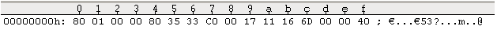
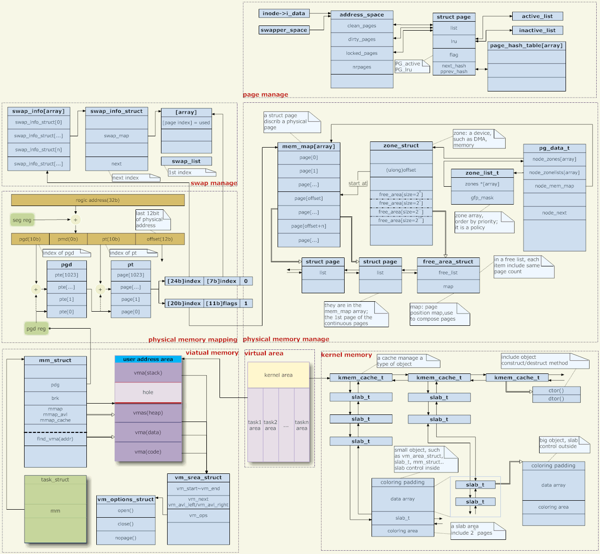

如今大家习惯以G计算的内存，但在较老的时代，内存资源非常紧张。所以内核提供了将物理硬盘虚拟成内存的方式，也即创建一个硬盘分区，将其挂载到/swap目录下，在内存不够的时候，可以从/swap分区申请内存。当然，/swap分区的运行效率比物理内存要低很多。

##linux地址名词解释
虚拟地址和线性地址其实是一个概念。  
MIPS处理器支持多个地址空间，每个地址空间有ASID（Address Space ID），放在EntryHi寄存器中。对应到linux，每个用户态进程，以及内核态，都有自己的ASID。进程空间切换的时候，需要修改这个寄存器。  

虚拟地址到物理地址的转换，需要CPU的MMU和TLB模块的协助。注意，这两个模块是CPU内部的，是硬件模块，而不是软件模块。

cpu工作在用户态模式时，取虚拟地址，经MMU，读寄存器取ASID，配合虚拟地址的VPN（virtual page number），查TLB缓存。如果命中，直接向MMU返回物理地址。如果没有，触发一个异常，由cpu的异常处理流程完成TLB缓存的重填（也即查内核中该进程的多级页表），再返回给MMU物理地址。如果物理地址不存在，则还会触发一个缺页异常，让相应异常处理流程完成内存页的换入。

内核态也有虚拟地址，用于vmalloc分配逻辑上连续，但物理上不连续的内存。工作模式和用户态的进程类似。


##物理内存的管理
需要解决的问题，如何快速定位任意一段内存。现代内存动则以G计算，按照原始的以字节来索引是不可能的，所以我们需要将内存拆分为页，便于定位 。linux内核在管理内存，需要将内存按照4K的大小划分为page。page的大小是可以调整为8K，或16K等，取决于内核编译时的配置。所有的page，由一个全局数组mem_map来维护，给定page的索引，即可以得到page的地址。给定page的索引，也可以很容易得到page对应的内存页面的线性地址。内核在分配内存时，只分配完整的内存页。

首先，内存划分为节点，一个节点关联到一个处理器。在多核处理器中，如果有多块内存，涉及到这项技术。在多核处理器中，处理器和内存之间的距离是不一致的，所以访问的速度也会有差异。这也会内存管理带来很多麻烦事情。不过幸运的是，目前的嵌入式系统中，有使用到多核处理器，但只有一块内存，所以这个问题不存在。只需要考虑UMA的情况。也即处理器对内存块的任意地址方式时间是相同的情况。

然后，需要将节点划分为不同的内存域。也就是我们常说的，DMA、NORMAL、HIGHMEM内存。所谓DMA，直接映射的内存区域，通常供外设和cpu共享内存。比如以太网收发包驱动，需要初始化DMA。NORMAL，就是常规的内核和用户态进程使用的内存。HIGHMEM，是指在内存的高端区域，内核初始化的时候不会使用到这段内存。使用该技术，可以将一些需要热重启时仍然需要保留的内存放在这一段区域，重启后仍然可以读取。

节点，对应的数据结构为struct pg_data_t。首先，该数据结构需要包含它的所有的内存区域，DMA、NORMAL等，然后，它需要管理所有可用的物理页，包括数量和地址信息，再然后，需要一个内存换出的进程以及等待队列，在内存不足的时候，回收内存。

内存区域，对应的数据结构为struct zone。1），它使用struct free_area及同名数组，管理伙伴系统。2），为避免频繁回收内存影响性能，需要设置一系列的水线或者称之为阀值，只有当内存数量多于或少于阀值的时候，才会启用内存回收。内存区域也会预留一部分内存，用于紧急情况的内存分配，数组为lowmem_reserve[MAX_NR_ZONES]。3）其他进程可能等待某一页内存变为可用，然后内核通知进程恢复工作。4）关于冷热内存页，参考“高速缓存页”

内存区域的下一级概念，是页帧，用struct page表示。page是内存页的管理单元，需要维护每个内存页的权限、引用计数、等待队列等。

##线性地址到物理地址的映射
编译linux内核，会生成system.map文件，包含了静态链接进内核的所有函数的地址。内核将被装载到物理内存的固定位置，这些地址信息和最终符号的真实地址是一致的。这一点对于故障调试至关重要，比如内核在某个函数中挂死，系统给出了出问题时的EPC信息，可以直接到符号表中查找该地址信息对应的函数，还可以将内核反汇编，对照代码分析问题原因。这里强调了静态链接进内核，是因为内核支持动态加载的模块，通常是ko文件，其函数地址是insmod模块时，动态生成的。可以通过查看/proc/module查看模块被加载的地址。
```
# cat /proc/modules
wl 1186336 0 - Live 0xc0a69000 (P)
ohci_hcd 22336 0 - Live 0xc0797000
ehci_hcd 36672 0 - Live 0xc077f000
```

查看system.map文件，可以分析内核符号在内存中映射的一些特点
```
80010000 A _text
80010400 T _stext
```
内核的符号表从0x10000开始，是因为前面的1M内存通常有它用，比如留给boot使用。可以看到，内核是从0x80010000开始存放代码的。比如80010408 T do_one_initcall。那么0x80010000前面64k字节就用来存放一些杂七杂八的信息。 下面的例子，是68380初始化过程中，内核从boot中获取启动参数的方式。可以看到，CFE将_text前面的2个long型值作为了指针，指向boot的参数。
```c
void __init retrieve_boot_loader_parameters(void)
{
    extern unsigned char _text;
    unsigned long blparms_magic = *(unsigned long *) (&_text - 8);
    unsigned long blparms_buf = *(unsigned long *) (&_text - 4);
    unsigned char *src = (unsigned char *) blparms_buf;
    unsigned char *dst = g_blparms_buf; /*这个字段中就会用来存放一些bootloader的参数*/
...
}
```
直接打开vmlinux.lz文件，可以看到最前面几个long变量的作用：80010000是_text的地址，803533c0是start_entry的地址。00171116是vmlinuz的长度。 可以参考bootFromNandFs的代码。
  

如果在编译阶段，就可以知道自己所有变量的地址，这种情况的内存管理比较简单。1）直接定义几个宏，在物理地址和编译阶段就确定下来的线性地址之间转换即可 。一些单片机，微处理器就可以这样做 。2）定义一个bit map，一个bit位对应一个page。申请内存的时候，遍历bitmap，找到合适大小的内存页，并修改bitmap。事实上，这正式linux在启动阶段的内存管理方式，称之为bootmem。此时对于linux的内核而言，使用编译阶段确定的符号或变量，用一个宏将线性地址转换为物理地址了，也就是__pa宏 。反方向的，如果是将物理地址转化为线性地址，则使用__va宏。
```
#define __pa(x)     ((unsigned long)(x) - PAGE_OFFSET + PHYS_OFFSET)
#define __va(x)    ((void *)((unsigned long)(x) + PAGE_OFFSET - PHYS_OFFSET))
```
PHYS_OFFSET用于定义RAM物理地址的偏移，在编译时指定，如果没有指定，则为0，表示物理内存的地址从0开始。在32位MIPS中，PAGE_OFFSET为0x80000000。这个宏，实际上指定了用户地址空间和内核地址空间的分割点。高于0x80000000的地址在内核中使用，低于0x80000000的在用户态空间中使用。也即两者按照1:1的比例划分。这一点并不固定，比如在IA32中，通常用户态和内核态的地址空间按照3:1的比例来划分，PAGE_OFFSET为0xC00000000。因此, 在内核中，给定一个地址，比如内核的起始线性地址，0x80001000，经过__pa转化，就可以得到物理地址0x1000。


##伙伴系统##
如果内核要使用的内存在编译阶段都可以确定下来，那上面的直接转化方法就可以使用。但linux毕竟要处理动态分配内存的情况，需要将所以内存管理起来 。用数据结构struct page描述页，用mem_map索引页 。然后，需要将内存管理起来起来，引入伙伴系统 。为了解决内核碎片问题，引入页回收和移动的方法 。为便于小块内存分配，引入slab机制。kmalloc

mem_map的地址不是固定的。804b92f8 B mem_map。固定的地址只有80010000 A _text。

考虑申请和释放内存时的多样性，主要是申请page个数，以及权限方面的不一致，单纯依靠一个mem_map指针来管理显然是不现实的。

内核依靠伙伴系统来做具体的物理内存管理工作。伙伴系统，类似于多级的批发商和供应商的机制。

比如地址临近的两个内存页为一组伙伴，他们可以单独分配，但当两个页都空闲的时候，则可以合在一起，组成一个更大的内存快，作为下一层次某个内存快的伙伴。内存块的大小，按照2^order个page组织，也即内存块可以为4K，8K，16K，32K...等。比如申请一个8K的内存块，首先去维护8K的内存块相应的链表中去查找，是否有空闲的内存块。如果有，则直接返回，并将内存块对应的管理page标记为已使用。如果没有，那么需要从它的上一级内存块管理链表那里去批发一个16K的内存快，拆成两份，放到它的链表中。然后再申请一块8K的内存块，标记相应的管理page为已使用，然后返回给调用者。在释放内存的时候，有相反的过程。首先将内存块归还到相应的空闲内存块链表下，然后再检查该内存块是否有空闲的内存块伙伴，如果有的话，将两个内存块合并为一个，放入上一级的内存块批发商那里。要保证本级内存供应商能够快速分配内存，所以需要建立一定的缓存仓库，当本级的内存块少于某个数量的时候，开始去上一级内存块批发商那里去申请一大块内存，当本级的内存块数量多于某个值的时候，就需要去遍历它维护的所有内存块，找到伙伴内存，合并为一个更大的内存块，归还到它的上一级内存块中。（我不知道内核具体是否这样sh）

数据结构：
```c
struct zone
{   。。。
    struct free_area free_area[max_order] ; 不同长度的空闲区域。
}
struct free_area
{
    struct list_head free_list[MIGRATE_TYPE] ；
    unsigned long nr_free ;
}
```
可通过cat /proc/buddyinfo查看伙伴系统内存的状态信息。可以看出，伙伴系统用了DMA、NORMAL等几个不同的行表示。基于伙伴系统的内存管理专注于某个节点的某个内存域，比如DMA或者高端内存域。

分配内存页的接口API
```c
alloc_pages(mask, order)  返回struct page的实力，表示分配的内存块的起始页。调用alloc_pages_node实际做内存分配工作。__alloc_pages(gfp_mask, order,  NODE_DATA(nid)->node_zonelists + gfp_zone(gfp_mask));
__get_free_pages(mask, order)和__get_free_page(mask)  直接返回内存的虚拟地址，而不是page页。
mask为分配内存时的掩码，
__GFP_WAIT    分配内存的请求可以被中断
__GFP_IO         在查找空闲内存期间，可以进行I/O操作，即设置了该标志位，可以讲选择的页写入磁盘。
#define GFP_ATOMIC  __GFP_HIGH  原子分配，不能被打断
#define GFP_KERNEL   (__GFP_WAIT | __GFP_IO  | __GFP_FS )  如果分配不到，会sleep 调用者线程，然后内核尝试去找内存。
#define GFP_USER       (__GFP_WAIT | __GFP_IO  | __GFP_FS  | __GFP_HARDWALL )  __GFP_HARDWALL在NUMA上才有意义。
```

###内存碎片问题
碎片怎么产生的，暂且不追究，但后果却是很很严重。明明有很多的空闲页，但是因为被一些使用中的页阻隔，无法连成一片，合并为更大的内存块，导致分配失败。要解决这个问题，必须由守护进程将内存页从一个地方移到另外的地方，从而产生相邻的空闲内存块，方便合并为一个更大的内存块。

内存可以几类：
* 不可移动页：比如内核的代码区。事实上这部分内存页不需要移动，因为大都是在初始化是就分配好了的。
* 可回收页：不能移动，但可以删除。
* 可移动页：比如用户态进程的内存页，他们是通过页表映射的。

##kmalloc
在伙伴系统中，讲到内存分配，类似于多级批发商。但是每次申请一个page，这个粒度对于很多模块来说，仍然显得太大了。可以将kmalloc类比为当下流行的虚拟运营商，它从伙伴系统中批发会一些page，根据使用者对内存的需求，把page拆分为一个个的小块，放到它的仓库中，等待被分配。比如，内核中大量使用到struct sk_sbuff结构体，可以先预分配一些page，拆分成struct sk_buff。另一类，使用者在分配内存的时候，并没有明确要分配给哪个结构体，只有一个size。这时候，仍然kmalloc仍然可以解决问题，它会预先批发出一些page，按照2^order大小，拆成一些块。当分配内存的时候，会找最接近的一个块分配出去。虽然牺牲了一些内存，但是提升了效率。

为便于管理，slab使用了三个链表，分别管理full、paritial、free的mem_cache

kmalloc会首先从cache中查找，然后调用get_free_pages(),最终调用__alloc_pages分配内存。在该函数中，调用might_sleep_if(wait)，它会根据是否设置__GFP_WAIT决定might_sleep()，即might_resched()。如果定义了CONFIG_PREEMPT_VOLUNTARY，那么might_resched为cond_resched，否则，might_resched为空。

slab的应用举例
```
skbuff_head_cache = kmem_cache_create("skbuff_head_cache",
           sizeof(struct sk_buff),
           0,
           SLAB_HWCACHE_ALIGN|SLAB_PANIC,
           NULL);
skb = kmem_cache_alloc_node(cache, gfp_mask & ~__GFP_DMA, node);
n = kmem_cache_alloc(skbuff_head_cache, gfp_mask);
kmem_cache_alloc(malloc_sizes[i].cs_cachep, flags);          kmalloc时调用
kmem_cache_alloc(malloc_sizes[i].cs_dmacachep, flags);   去DMA区申请内存
```

##页表管理
无论是kernel还是在用户态，都有申请不连续内存页的需求。这是因为，对内核态而言，如果要申请较大的内存，如果要求内存页在物理上是连续的，那么失败的几率会高，花费的时间要长（内存碎片），因此是不核算的。而使用者可能只需要内存的线性地址连续即可。对用户态而言，进程根本就看不到page这一层面。

内核使用页表来完成不连续内存的分配。如下是页表的映射过程：


页式映射过程：
1. 内核为MMU设置好目录PGD，MMU用线性地址中最高的10位作为下标在PGD中找到相应的表项，该表项逻辑上指向一个中间目录PMD，但是物理上指向页表,MMU并不知道PMD的存在。
1. PMD只是在逻辑上存在，即只对内核在概念上存在，所谓的映射就是保持原值不变。 
1. 内核为MMU设置好所有的页面表，MMU用线性地址中的PT字段作为下标找到相应的表项PTE，该表项中存放的就是物理页面的指针。
4. 线性地址中的最后位段为物理页面内的相对偏移量，MMU将此偏移与目标页面的起始地址相加就得到相应的物理地址。 
上述机制，一般用于用户态内存的分配。每个进程都有它自己的pgd。在进程切换的时候，需要将其pgd存入CR3寄存器中。然后按照页表方式查询可得到真实的page页。

内核态的pgd。
```c
#define pgd_offset_k(address) pgd_offset(&init_mm, address)
```

##vmalloc申请不连续内存
vmalloc分配的过程:
1. 首先申请一个struct vm_area，相当于虚拟地址的区域。`__get_vm_area_node(size, flags, VMALLOC_START, VMALLOC_END, node, gfp_mask);`
2. 然后，为area->pages[i]逐个分配page。
3. 最后完成PGD和vm_struct虚拟地址的映射。`map_vm_area(area, prot, &pages)`

```
vmalloc
    |-->__vmalloc_node_flags(size, -1, GFP_KERNEL | __GFP_HIGHMEM)   
    (node为-1，首先尝试从高端物理内存分配， GFP_KERNEL表示分配过程中可以被打断)
        |-->__vmalloc_node(size, 1, flags, PAGE_KERNEL,  node, __builtin_return_address(0))    
        由于__vmalloc_node_flags是inline函数，因此__buildin_return_address(0)实际记录的是这个vmalloc的调用者。可用于回溯内存使用者。
            |-->__vmalloc_node_range(size, align, VMALLOC_START, VMALLOC_END,  gfp_mask, prot, node, caller);  
            分配的虚拟内存开始地址为从0xc000 0000（arch/mips/include/asm/pgtable-32.h），结束位置在永久映射内存的开始位置
                |-->area = __get_vm_area_node(size, align, VM_ALLOC | VM_UNLIST,  start, end, node, gfp_mask, caller);  
                申请一个具备连续地址段的虚拟内存区域vm_area  
                |-->addr = __vmalloc_area_node(area, gfp_mask, prot, node, caller)   
                返回虚拟内存的地址。不同的node，虚拟地址会有区别。  
                     |-->area->pages[i++] = alloc_pages_node(node, tmp_mask, order)  
                     为area分配内存页，赋给area->pages。物理内存在这里是否已经分配了？表示怀疑。
                     |-->map_vm_area(area, prot, &pages)   
                     将vm区和pages关联起来。也即，给定虚拟地址，能够直接插到它的物理地址。而不是先找它的vm_area，再找对应的page。
                          |-->vmap_page_range(addr, end, prot, *pages) 调用vmap完成实际的关联
```

##高端内存管理
由于内核虚拟地址空间有限，导致超过896M的内存无法直接映射，这部分内存区域被称为高端内存。高端内存的虚拟地址，需要在使用时，给定page，动态获取它的虚拟地址。这也就是kmap的由来。如果计算虚拟地址过程中不能被打断，则使用kmap_atomic来映射。kmap在文件系统中使用得最多。内核源码中的Highmem.txt对高端内存解释得非常清楚。直接引用参考。

```
==================== WHAT IS HIGH MEMORY? ====================
High memory (highmem) is used when the size of physical memory approaches or exceeds the maximum size of virtual memory. At that point it becomes impossible for the kernel to keep all of the available physical memory mapped at all times. This means the kernel needs to start using temporary mappings of the pieces of physical memory that it wants to access.
```

###永久映射
kmap  将一个高端内存页永久映射到一个虚拟地址，用于进程上下文，可使用kunmap解除映射。永久映射若需要修改映射关系需要先释放映射再创建新的映射关系。
```c
#define PKMAP_NR(virt) ((virt-PKMAP_BASE) >> PAGE_SHIFT)
#define PKMAP_ADDR(nr) (PKMAP_BASE + ((nr) << PAGE_SHIFT))
void *kmap(struct page *page)    //建立永久映射
{
 void *addr;
might_sleep(); 
 if (!PageHighMem(page))      //检查物理页是否属于高端内存范围。在page-flags.h中定义。仅在CONFIG_HIGHMEM时生效
  return page_address(page);    //如果不是高端内存，那么直接返回该地址对应的虚拟地址。？？
 addr = kmap_high(page);       //使用page_address获取该page的虚拟地址。如果没有虚拟地址，则使用map_new_virtual为它分配一个。pkmap_count[PKMAP_NR(vaddr)]++;  这个虚拟地址，就位于kmap区。
 flush_tlb_one((unsigned long)addr);    //更新TLB
return addr; 
}
static inline unsigned long map_new_virtual(struct page *page){ ... }
```
从全局数组pkmap_count中找一个未使用的虚拟地址页号，得到该页号对应的虚拟地址，设置该page的虚拟地址，在全局数组中将这个虚拟地址的页号标记为已经使用。如果找不到，那么初始化一个等待队列，等待其他的进程使用kunmap释放虚拟地址，然后再重头开始查找。在当前进程睡眠的时候，其他进程有可能已经kmap了这个page，因此在从睡眠中唤醒的时候，还需要调用page_address(page)检查是否非0。

在MIPS中，最多支持映射1024（LAST_PKMAP）个page，即最多同时映射4M的高端内存。因此，这个循环数组的大小为1024个。当数组翻转时，需要使用flush_all_zero_pkmaps，需要将相关TLB全部失效。因此，它的效率就更低一些。
```
#define PKMAP_NR(virt) ((virt-PKMAP_BASE) >> PAGE_SHIFT)  得到一个高端内存虚拟地址的页号。PKMAP_BASE在mips中，为0xfe000000（pgtable-32.h）。
```

如果没有使用到高端内存，则直接返回这个page的虚拟地址。
```c
include/linux/highmem.h
static inline void *kmap(struct page *page)
{
 might_sleep();
 return page_address(page);
}
```

###不可休眠临时映射
临时映射就是直接再映射一次把前面的映射关系覆盖掉就行了，确实是比较临时；所以临时映射不会睡眠，它不会像永久映射，可能产生条目满需要等待其他条目被释放的情况，如果条目满了它只需覆盖掉一个就行了；临时映射是原子的，不会加锁，使用于简短的的代码。
```c
void *kmap_atomic(struct page *page) ，
临时映射的起始地址为0xff000000（FIXADDR_TOP），在arch/mips/include/asm/mach-bcm63xx/spaces.h中定义
临时映射的结束地址为__end_of_fixed_addresses，根据配置宏，会有所区别。
void *kmap_atomic(struct page *page)
{
 unsigned long vaddr;
 int idx, type;
 /* even !CONFIG_PREEMPT needs this, for in_atomic in do_page_fault */ 
 pagefault_disable();              //关闭缺页异常
 if (!PageHighMem(page))
  return page_address(page);
 
type = kmap_atomic_idx_push();     获取本地cpu的临时映射的__kmap_atomic_idx
 idx = type + KM_TYPE_NR*smp_processor_id();    得到全局临时映射的id号
 vaddr = __fix_to_virt(FIX_KMAP_BEGIN + idx);      将这个id号直接转化为虚拟地址
 set_pte(kmap_pte-idx, mk_pte(page, PAGE_KERNEL));      MIPS中，kmap_pte=kmap_get_fixmap_pte(kmap_vstart)
 local_flush_tlb_one((unsigned long)vaddr);         在本地cpu上刷新当前vaddr对应的tlb条目
 return (void*) vaddr; 
}

FIX_CMAP
void __init kmap_coherent_init(void)
{
 unsigned long vaddr;
 /* cache the first coherent kmap pte */
 vaddr = __fix_to_virt(FIX_CMAP_BEGIN);
 kmap_coherent_pte = kmap_get_fixmap_pte(vaddr);
}
```

##用户态内存申请
###mmap
remap_pfn_range  只能映射保留内存和高端内存，常规内存无法映射。如果要映射常规内存，可以使用nopage。  
io_remap_page_range，映射io内存到虚拟地址中。


###brk
用于malloc，在堆上时申请小的内存块。


---


##[地址映射]图：左中
linux内核使用页式内存管理，应用程序给出的内存地址是虚拟地址，它需要经过若干级页表一级一级的变换，才变成真正的物理地址。

想一下，地址映射还是一件很恐怖的事情。当访问一个由虚拟地址表示的内存空间时，需要先经过若干次的内存访问，得到每一级页表中用于转换的页表项（页表是存放在内存里面的），才能完成映射。也就是说，要实现一次内存访问，实际上内存被访问了N+1次（N=页表级数），并且还需要做N次加法运算。

所以，地址映射必须要有硬件支持，mmu（内存管理单元）就是这个硬件。并且需要有cache来保存页表，这个cache就是TLB（Translation lookaside buffer）。

尽管如此，地址映射还是有着不小的开销。假设cache的访存速度是内存的10倍，命中率是40%，页表有三级，那么平均一次虚拟地址访问大概就消耗了两次物理内存访问的时间。

于是，一些嵌入式硬件上可能会放弃使用mmu，这样的硬件能够运行VxWorks（一个很高效的嵌入式实时操作系统）、linux（linux也有禁用mmu的编译选项）、等系统。

但是使用mmu的优势也是很大的，最主要的是出于安全性考虑。各个进程都是相互独立的虚拟地址空间，互不干扰。而放弃地址映射之后，所有程序将运行在同一个地址空间。于是，在没有mmu的机器上，一个进程越界访存，可能引起其他进程莫名其妙的错误，甚至导致内核崩溃。

在地址映射这个问题上，内核只提供页表，实际的转换是由硬件去完成的。那么内核如何生成这些页表呢？这就有两方面的内容，虚拟地址空间的管理和物理内存的管理。（实际上只有用户态的地址映射才需要管理，内核态的地址映射是写死的。）

##[虚拟地址管理] 图：左下
每个进程对应一个task结构，它指向一个mm结构，这就是该进程的内存管理器。（对于线程来说，每个线程也都有一个task结构，但是它们都指向同一个mm，所以地址空间是共享的。）

mm->pgd指向容纳页表的内存，每个进程有自已的mm，每个mm有自己的页表。于是，进程调度时，页表被切换（一般会有一个CPU寄存器来保存页表的地址，比如X86下的CR3，页表切换就是改变该寄存器的值）。所以，各个进程的地址空间互不影响（因为页表都不一样了，当然无法访问到别人的地址空间上。但是共享内存除外，这是故意让不同的页表能够访问到相同的物理地址上）。

用户程序对内存的操作（分配、回收、映射、等）都是对mm的操作，具体来说是对mm上的vma（虚拟内存空间）的操作。这些vma代表着进程空间的各个区域，比如堆、栈、代码区、数据区、各种映射区、等等。

用户程序对内存的操作并不会直接影响到页表，更不会直接影响到物理内存的分配。比如malloc成功，仅仅是改变了某个vma，页表不会变，物理内存的分配也不会变。

假设用户分配了内存，然后访问这块内存。由于页表里面并没有记录相关的映射，CPU产生一次缺页异常。内核捕捉异常，检查产生异常的地址是不是存在于一个合法的vma中。如果不是，则给进程一个"段错误"，让其崩溃；如果是，则分配一个物理页，并为之建立映射。

##[物理内存管理]图：右上
那么物理内存是如何分配的呢？

首先，linux支持NUMA（非均质存储结构），物理内存管理的第一个层次就是介质的管理。pg_data_t结构就描述了介质。一般而言，我们的内存管理介质只有内存，并且它是均匀的，所以可以简单地认为系统中只有一个pg_data_t对象。

每一种介质下面有若干个zone。一般是三个，DMA、NORMAL和HIGH。

DMA：因为有些硬件系统的DMA总线比系统总线窄，所以只有一部分地址空间能够用作DMA，这部分地址被管理在DMA区域（这属于是高级货了）；

HIGH：高端内存。在32位系统中，地址空间是4G，其中内核规定3~4G的范围是内核空间，0~3G是用户空间（每个用户进程都有这么大的虚拟空间）（图：中下）。前面提到过内核的地址映射是写死的，就是指这3~4G的对应的页表是写死的，它映射到了物理地址的0~1G上。（实际上没有映射1G，只映射了896M。剩下的空间留下来映射大于1G的物理地址，而这一部分显然不是写死的）。所以，大于896M的物理地址是没有写死的页表来对应的，内核不能直接访问它们（必须要建立映射），称它们为高端内存（当然，如果机器内存不足896M，就不存在高端内存。如果是64位机器，也不存在高端内存，因为地址空间很大很大，属于内核的空间也不止1G了）；

NORMAL：不属于DMA或HIGH的内存就叫NORMAL。

在zone之上的zone_list代表了分配策略，即内存分配时的zone优先级。一种内存分配往往不是只能在一个zone里进行分配的，比如分配一个页给内核使用时，最优先是从NORMAL里面分配，不行的话就分配DMA里面的好了（HIGH就不行，因为还没建立映射），这就是一种分配策略。

每个内存介质维护了一个mem_map，为介质中的每一个物理页面建立了一个page结构与之对应，以便管理物理内存。

每个zone记录着它在mem_map上的起始位置。并且通过free_area串连着这个zone上空闲的page。物理内存的分配就是从这里来的，从 free_area上把page摘下，就算是分配了。（内核的内存分配与用户进程不同，用户使用内存会被内核监督，使用不当就"段错误"；而内核则无人监督，只能靠自觉，不是自己从free_area摘下的page就不要乱用。）

##[建立地址映射]
内核需要物理内存时，很多情况是整页分配的，这在上面的mem_map中摘一个page下来就好了。比如前面说到的内核捕捉缺页异常，然后需要分配一个page以建立映射。

说到这里，会有一个疑问，内核在分配page、建立地址映射的过程中，使用的是虚拟地址还是物理地址呢？首先，内核代码所访问的地址都是虚拟地址，因为CPU指令接收的就是虚拟地址（地址映射对于CPU指令是透明的）。但是，建立地址映射时，内核在页表里面填写的内容却是物理地址，因为地址映射的目标就是要得到物理地址。

那么，内核怎么得到这个物理地址呢？其实，上面也提到了，mem_map中的page就是根据物理内存来建立的，每一个page就对应了一个物理页。

于是我们可以说，虚拟地址的映射是靠这里page结构来完成的，是它们给出了最终的物理地址。然而，page结构显然是通过虚拟地址来管理的（前面已经说过，CPU指令接收的就是虚拟地址）。那么，page结构实现了别人的虚拟地址映射，谁又来实现page结构自己的虚拟地址映射呢？没人能够实现。

这就引出了前面提到的一个问题，内核空间的页表项是写死的。在内核初始化时，内核的地址空间就已经把地址映射写死了。page结构显然存在于内核空间，所以它的地址映射问题已经通过“写死”解决了。

由于内核空间的页表项是写死的，又引出另一个问题，NORMAL（或DMA）区域的内存可能被同时映射到内核空间和用户空间。被映射到内核空间是显然的，因为这个映射已经写死了。而这些页面也可能被映射到用户空间的，在前面提到的缺页异常的场景里面就有这样的可能。映射到用户空间的页面应该优先从HIGH区域获取，因为这些内存被内核访问起来很不方便，拿给用户空间再合适不过了。但是HIGH区域可能会耗尽，或者可能因为设备上物理内存不足导致系统里面根本就没有HIGH区域，所以，将NORMAL区域映射给用户空间是必然存在的。

但是NORMAL区域的内存被同时映射到内核空间和用户空间并没有问题，因为如果某个页面正在被内核使用，对应的page应该已经从free_area被摘下，于是缺页异常处理代码中不会再将该页映射到用户空间。反过来也一样，被映射到用户空间的page自然已经从free_area被摘下，内核不会再去使用这个页面。

##[内核空间管理] 图：右下
除了对内存整页的使用，有些时候，内核也需要像用户程序使用malloc一样，分配一块任意大小的空间。这个功能是由slab系统来实现的。

slab相当于为内核中常用的一些结构体对象建立了对象池，比如对应task结构的池、对应mm结构的池、等等。

而slab也维护有通用的对象池，比如"32字节大小"的对象池、"64字节大小"的对象池、等等。内核中常用的kmalloc函数（类似于用户态的malloc）就是在这些通用的对象池中实现分配的。

slab除了对象实际使用的内存空间外，还有其对应的控制结构。有两种组织方式，如果对象较大，则控制结构使用专门的页面来保存；如果对象较小，控制结构与对象空间使用相同的页面。

除了slab，linux 2.6还引入了mempool（内存池）。其意图是：某些对象我们不希望它会因为内存不足而分配失败，于是我们预先分配若干个，放在mempool中存起来。正常情况下，分配对象时是不会去动mempool里面的资源的，照常通过slab去分配。到系统内存紧缺，已经无法通过slab分配内存时，才会使用 mempool中的内容。

##[页面换入换出] 图：左上  图：右上
页面换入换出又是一个很复杂的系统。内存页面被换出到磁盘，与磁盘文件被映射到内存，是很相似的两个过程（内存页被换出到磁盘的动机，就是今后还要从磁盘将其载回内存）。所以swap复用了文件子系统的一些机制。

页面换入换出是一件很费CPU和IO的事情，但是由于内存昂贵这一历史原因，我们只好拿磁盘来扩展内存。但是现在内存越来越便宜了，我们可以轻松安装数G的内存，然后将swap系统关闭。于是swap的实现实在让人难有探索的欲望，在这里就不赘述了。（另见：《linux内核页面回收浅析》）

##[用户空间内存管理]
malloc是libc的库函数，用户程序一般通过它（或类似函数）来分配内存空间。

libc对内存的分配有两种途径，一是调整堆的大小，二是mmap一个新的虚拟内存区域（堆也是一个vma）。

在内核中，堆是一个一端固定、一端可伸缩的vma（图：左中）。可伸缩的一端通过系统调用brk来调整。libc管理着堆的空间，用户调用malloc分配内存时，libc尽量从现有的堆中去分配。如果堆空间不够，则通过brk增大堆空间。

当用户将已分配的空间free时，libc可能会通过brk减小堆空间。但是堆空间增大容易减小却难，考虑这样一种情况，用户空间连续分配了10块内存，前9块已经free。这时，未free的第10块哪怕只有1字节大，libc也不能够去减小堆的大小。因为堆只有一端可伸缩，并且中间不能掏空。而第10块内存就死死地占据着堆可伸缩的那一端，堆的大小没法减小，相关资源也没法归还内核。

当用户malloc一块很大的内存时，libc会通过mmap系统调用映射一个新的vma。因为对于堆的大小调整和空间管理还是比较麻烦的，重新建一个vma会更方便（上面提到的free的问题也是原因之一）。

那么为什么不总是在malloc的时候去mmap一个新的vma呢？第一，对于小空间的分配与回收，被libc管理的堆空间已经能够满足需要，不必每次都去进行系统调用。并且vma是以page为单位的，最小就是分配一个页；第二，太多的vma会降低系统性能。缺页异常、vma的新建与销毁、堆空间的大小调整、等等情况下，都需要对vma进行操作，需要在当前进程的所有vma中找到需要被操作的那个（或那些）vma。vma数目太多，必然导致性能下降。（在进程的vma较少时，内核采用链表来管理vma；vma较多时，改用红黑树来管理。）

##[用户的栈]
与堆一样，栈也是一个vma（图：左中），这个vma是一端固定、一端可伸（注意，不能缩）的。这个vma比较特殊，没有类似brk的系统调用让这个vma伸展，它是自动伸展的。

当用户访问的虚拟地址越过这个vma时，内核会在处理缺页异常的时候将自动将这个vma增大。内核会检查当时的栈寄存器（如：ESP），访问的虚拟地址不能超过ESP加n（n为CPU压栈指令一次性压栈的最大字节数）。也就是说，内核是以ESP为基准来检查访问是否越界。

但是，ESP的值是可以由用户态程序自由读写的，用户程序如果调整ESP，将栈划得很大很大怎么办呢？内核中有一套关于进程限制的配置，其中就有栈大小的配置，栈只能这么大，再大就出错。

对于一个进程来说，栈一般是可以被伸展得比较大（如：8MB）。然而对于线程呢？

首先线程的栈是怎么回事？前面说过，线程的mm是共享其父进程的。虽然栈是mm中的一个vma，但是线程不能与其父进程共用这个vma（两个运行实体显然不用共用一个栈）。于是，在线程创建时，线程库通过mmap新建了一个vma，以此作为线程的栈（大于一般为：2M）。

可见，线程的栈在某种意义上并不是真正栈，它是一个固定的区域，并且容量很有限。


