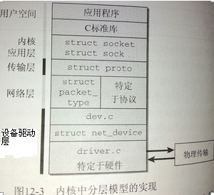
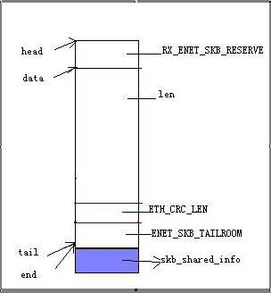

网络子系统的分层



#设备驱动层
##NAPI收包（参考BCM4.16L02 SDK）
NAPI收包包括三个主要流程：
1. 将中断号映射到处理函数上，
1. 在硬中断函数中触发软中断，
1. 软中断调度执行收包流程。之后报文进入到网络层即内核协议栈。4）报文的回收与DMA的释放。

###将中断号映射到处理函数上
包括为收包申请DMA用于驱动存放报文，申请一个BD ring用于管理DMA，申请一个skb的池用于管理buffer，配置硬件dma寄存器。实际上，这些代码位于驱动初始化的不同位置。中断的初始化在bcm63xx_init_rxdma_structures()中，而buffer的初始化位于init_buffers()中。而硬件寄存器，则需要参考datasheet中iuDMA节，对照着看应该如何管理DMA。可以参考《63168-DS107-RDS_docs822783.pdf》中定义了大量的DMA，并且有专门的dma控制器。

由于网关产品通常会有一个交换芯片，所以需要在驱动做管理一些虚拟接口vport，并为每个vport创建pDevCtx上下文环境。并在收报的时候，将中断号转化为上下文信息 。

bcm63xx_init_rxdma_structures(BcmEnet_devctrl *pDevCtrl)  初始化收包的rxdma。

博通SDK封装操作系统提供的request_irq函数为BcmHalMapInterruptEx()。  
BcmHalMapInterrupt(bcmeapi_enet_isr, BUILD_CONTEXT(pDevCtrl, 0), rxIrq);

FN_HANDLER_RT bcm63xx_gphy_isr(int irq, void * dev_id)  
一个典型的中断处理函数，返回值irqreturn_t包括三个。第一个参数，表示中断号。第二个参数，表示设备id。由于中断号较少，因此存在多个外设共享一个中断号的情况。

如果共享中断，irqflags设置SA_SHIRQ属性，这样就允许别的设备申请同一个中断。需要注意所有用到这个中断的设备在调用request_irq()都必须设置这个属性。系统在回调每个中断处理程序时，可以用dev_id这个参数找到相应的设备。一 般dev_id就设为device结构本身。系统处理共享中断是用各自的dev_id参数依次调用每一个中断处理程序。 

###在硬中断函数中触发软中断
bcmeapi_enet_isr(irq, pContext) -> BCMENET_WAKEUP_RXWORKER(pDevCtrl)  --> napi_schedule(&((x)->napi))  -->判断napi能否被调度，再__napi_schedule(n) --> 关闭硬中断，在本地cpu上启用napi，\_\_\_\_napi_schedule(&\_\_get_cpu_var(softnet_data), n);  --> 将当前napi添加到本地cpu的softnet_data上（list_add_tail(&napi->poll_list, &sd->poll_list)），然后触发软中断（\_\_raise_softirq_irqoff(NET_RX_SOFTIRQ)） pContext为映射中断是给定的参数。

###软中断调度执行收包流程
1. 在net_dev_init()中，首先为每个cpu初始化softnet_data，及相关队列。注意，为兼容就的API，使用sd->backlog.poll。
2. 然后初始化软中断open_softirq(NET_RX_SOFTIRQ, net_rx_action);open_softirq(NET_TX_SOFTIRQ, net_tx_action);
3. net_rx_action为进入软中断收发包函数的起始点。在取softnet_data时，需要关闭本地硬件中断。
```c
while (!list_empty(&sd->poll_list)){
n = list_first_entry(&sd->poll_list, struct napi_struct, poll_list);
work = n->poll(n, weight);  如果当前napi可以调度，这调用他的poll函数。
}
```
每个napi对应的poll函数，在bcmenet.c中初始化。  
netif_napi_add(dev, &pDevCtrl->napi, bcm63xx_enet_poll_napi, NETDEV_WEIGHT);

当软中断检查到这个napi时，将会调用到轮询函数bcm63xx_enet_poll_napi。轮询函数中，按照NAPI的规范，尝试一次收取budget个报文。work_done = bcm63xx_rx(pDevCtrl, budget);bcm63xx_rx会去做实际的收发包工作，包括遍历所有的DMA，找到可用的，申请skb，关联他的data，然后使用netif_receive_skb将报文送入到协议栈。

###napi和旧的收包api的区别
旧的api中，每次触发中断，只能处理一个包。由于cpu主频高，所以对于低速设备是够用的。但是对于高速设备，速度较低。

napi，核心思想是一次中断，关闭Rx中断，然后轮询DMA收包设备，处理多个报文，直到没有报文待处理，再重新启用Rx中断。报文的处理，都在中断的下半部，即软中断中处理。启用NAPI后，可能出现一种情况，某一个napi实例长时间占用一个软中断，导致其他的实例没有机会处理报文。为避免这种情况，每一个实例的处理时间最长为1HZ，就要切换走。或者，它用完所有的预算，就要切换走，并将这个napi实例放到轮询链表的尾巴上。

###为什么博通在3.4的内核中使用线程来收包
如果内核版本为3.4，那么处理的流程又还不一样。

 这个函数有两个参数，第一个为等待队列的头部，第二个参数，为判断条件。在硬中断中触发该等待队列的时候，需要设置这个判断条件。在此之后，流程和之前的一直，都是调用bcm63xx_rx(pDevCtrl, budget)来做实际的收包工作。

由于napi依赖于软中断，软中断实质上是一个内核线程，这个线程不仅仅要支持NET_RX_ACTION，还需要支持其他如定时器等其他的软中断事件，也即这个线程没有办法一心一意地收包，性能上肯定会受到影响。所以新的以太网收包驱动起了一个独立的线程收包。

仍然无法理解的是，为什么在这里要把调用bcm63xx_rx之间要把软中断关闭。

###初始化
以太驱动收包初始化时，创建一个内核线程，名称为bcmsw_rx，handle为bcm63xx_enet_rx_thread。
```c
    pDevCtrl->rx_work_avail = 0;
    init_waitqueue_head(&pDevCtrl->rx_thread_wqh);
    pDevCtrl->rx_thread = kthread_create(bcm63xx_enet_rx_thread, pDevCtrl, "bcmsw_rx");
    wake_up_process(pDevCtrl->rx_thread);
```

###激活等待队列
bcmeapi_enet_isr(irq, pContext) -> BCMENET_WAKEUP_RXWORKER(pDevCtrl) ->检查收包线程是否可用，wake_up_interruptible(&((x)->rx_thread_wqh)，激活当前收包上下文的等待队列。
```c
#define BCMENET_WAKEUP_RXWORKER(x) do { \
           if ((x)->rx_work_avail == 0) { \
               (x)->rx_work_avail = 1; \
               wake_up_interruptible(&((x)->rx_thread_wqh)); }} while (0)
```

###收包流程
```
static int bcm63xx_enet_rx_thread(void *arg)
{
    struct BcmEnet_devctrl *pDevCtrl=(struct BcmEnet_devctrl *) arg;
    uint32 work_done;
    uint32 ret_done;
    int budget = NETDEV_WEIGHT;

    while (1)
    {
        wait_event_interruptible(pDevCtrl->rx_thread_wqh, pDevCtrl->rx_work_avail); 

        local_bh_disable();
        /* got some work to do */
        bcmeapi_update_rx_queue(pDevCtrl);

        work_done = bcm63xx_rx(pDevCtrl, budget);
        ret_done = work_done & ENET_POLL_DONE;
        work_done &= ~ENET_POLL_DONE;
        local_bh_enable();

        BCM_ENET_RX_DEBUG("Work Done: %d \n", (int)work_done);

        if (work_done >= budget || ret_done != ENET_POLL_DONE)
        {
            bcmeapi_napi_leave(pDevCtrl);

             /*配额未用完，或在DMA上有包待处理，主动放弃cpu，让其他线程有机会处理。不过如果被打断的进程上下文调度策略不是FIFO或RR，那么继续执行。*/
            /*由于pDevCtrl->rx_work_avail仍然为1，所以进入wait_event_interruptible后会退出，什么也不做。这样可以继续调用bcm63xx_rx收包。*/
            if (current->policy == SCHED_FIFO || current->policy == SCHED_RR)
                yield();
        }
        else
        {
            /*报文处理完成，设置变量rx_work_avail为0，使能中断，使能等待队列重新等待*/
            pDevCtrl->rx_work_avail = 0;
            bcmeapi_napi_post(pDevCtrl);
        }
    }
    return 0; 
}
```

##netpoll收包
netpoll不依赖于网络协议栈，因此在内核网络及I/O子系统尚未可用时，也可以发送或接收数据包。当然netpoll能够处理的数据包类型也很有限，只有UDP和ARP数据包，并且只能是以太网报文。注意这里对UDP数据包的处理并不像四层的UDP协议那样复杂，并且netpoll可以发挥作用要依赖网络设备的支持。

##网络接入层
网络接入层的入口函数为netif_receive_skb

关于bridge收包，在br_if.c中创建桥接口，将桥接口添加eth接口时，为dev注册收包函数。netdev_rx_handler_register(dev, br_handle_frame, p)可以看到，这里的br_handle_frame是桥模块的入口函数  --> rcu_assign_pointer(dev->rx_handler, rx_handler);   
vlan模块的收包函数为bcm_vlan_handle_frame_hook = bcmVlan_devReceiveSkb;

在netif_receive_skb(skb)中，有两个分组类型的链表，ptype_all，和ptype_base[15]数组。在网络接入层收包的时候，可以检查收包接口是否匹配，确定是否将报文发到相应的接口。

SOCK_RAW是网络层(IP层)的,而SOCK_PACKET是数据链路层的.

建立套接字的时候选择SOCK_PACKET类型，内核将不对网络数据进行处理而直接交给用户，数据直接从网卡的协议栈交给用户。建立一个SOCK_PACKET类型的套接字使用如下方式：

socket (AF_INET, SOCK_PACKET,htons(0x0003));

其中AF_INET=2表示因特网协议族，SOCK_PACKET=10表示截取数据帧的层次在物理层，网络协议栈对数据不做处理。值0x0003表示截取的数据帧的类型为不确定，处理所有的包。

struct proto_ops packet_ops_spkt = {.bind = packet_bind_spkt}  -> packet_do_bind(sk, dev, pkt_sk(sk)->num)，其中dev是从创建socket时传入的设备名称  --> dev_add_pack(&po->prot_hook); 将分组的类型添加到分组的链表中，po从sock中提取，将传入的sk强制转化为packet_sock。 --> 如果pt->type的类型为ETH_P_ALL，则添加到ptype_all中，否则添加到ptype_base[hash]中。

skb = handle_bridge(skb, &pt_prev, &ret, orig_dev);    pt_prev是在遍历链表的最后一个分组类型。这个分组类型在handle_bridge中使用siliver_skb()分发报文。

###sk_buff的结构



##网络层

##传输层
socket结构的ops成员类型为struct proto_ops，用于和系统调用通信。而sock成员的proto类型为struct proto，用于和驱动通信。虽然两种数据结构的字段名称很多是一样的。

##应用层

具体到每一种网络处理函数的定义。·
```c
struct inet_protosw {
 struct list_head list;       //该链表记录相同type下所有的protocol。
 unsigned short type; /* This is the 2nd argument to socket(2). */     类型，type指SOCK_STREAM, SOCK_DGRAM, SOCK_RAW三种
 unsigned short protocol; /* This is the L4 protocol number. */          协议，在in.h中定义，包括ICMP、TCP，dummy IP
 struct proto *prot;      //类似于udp_prot等。 socket layer -> transport layer interface。包含一个kmem_cache字段，用于管理slab。
 const struct proto_ops *ops;    //提供给用户态的接口，赋值给sock->ops。
  int capability; /* Which (if any) capability do  we need to use this socket  interface   */ 
 char no_check; /* checksum on rcv/xmit/none? */
 unsigned char flags; /* See INET_PROTOSW_* below. */
};
```
transport -> network interface is defined by struct inet_proto


sys_socket
    |--> retval = sock_create(family, type, protocol, &sock); 根据参数创建socket。返回是否成功创建。
        |--> __sock_create(current->nsproxy->net_ns, family, type, protocol, res, 0)
            |-->pf->create(net, sock, protocol);
    |--> retval = sock_map_fd(sock); 根据sock，返回fd。调用sock_attach_fd，将fd和sock关联起来。

\_\_sock_creat
__sock_create(current->nsproxy->net_ns, family, type, protocol, res, 0) 
需要注意第一个参数，表示当前进程的network namespace，
最后一个参数，表示是否从内核创建的socket。内核icmp发包的__icmp_socket就是这样创建出来的。
(struct net *net, int family, int type, int protocol, struct socket **res, int kern)  
参数说明：family指PF_INET, PF_UNIX, PF_LOCAL等，type指SOCK_STREAM, SOCK_DGRAM, SOCK_RAW三种。
protocol为协议号，如icmp，也可以指定tpid，
res为指向指针的指针，向调用者返回创建的socket。
1. 使用sock_alloc申请socket，根据family参数找到对应的net_proto_family参数。如果相应的family没有加载到内核，还需要调用request_module("net-pf-%d", family)加载。内核支持的协议存放在net_families数组中，通过sock_register添加。目前支持34中协议。比如ipv4对应inet_family_ops。
2. 使用pf->create(net, sock, protocol)初始化socket。对于ipv4，使用inet_create
    |-->查找inetsw[sock->type]数组，其中sock->type即通过参数传入的type。
3. *res = sock，将申请的soct作为返回值传回。

pf->create(net, sock, protocol); 
创建sock。ipv4相关的protocol在inet_init中初始化。对inet_init的理解：首先初始化tcp_prot、udp_prot、raw_prot, 数据结构为struct proto，它包含提供给用户态的接口，如connect、poll等。对应几种在enum sock_type中定义的SOCK_STREAM，SOCK_DGRAM, SOCK_RAW等。然后初始化icmp_protocol、udp_protocol、tcp_protocol、igmp_protocol，数据结构为struct net_protocol表示提供给内核底层的接口。再初始化静态的list_head数组inetsw，保存struct inet_protosw的链表，包含了inet_create所需要的所有信息。首先便利inetsw_array数组，添加到inetsw中。也可以在SCTP等协议初始化时使用inet_register_protosw动态注册。还需要初始化arp_init、tcp_init、udp_init等。


该数组通过inet_register_protosw注册。

弄清楚流程，再来看select的内核态流程。
sys_select select使用文件系统的poll来实现，需要先弄明白wait_queue的实现方法。

socket_file_ops，有open、mmap等。但对于socket，没有open函数，只能通过sys_socket文件创建。
```c
static const struct file_operations socket_file_ops = {
 .owner = THIS_MODULE,
 .llseek = no_llseek,
 .aio_read = sock_aio_read,
 .aio_write = sock_aio_write,
 .poll = sock_poll,
 .unlocked_ioctl = sock_ioctl,
#ifdef CONFIG_COMPAT
 .compat_ioctl = compat_sock_ioctl,
#endif
 .mmap = sock_mmap,    /*对socket调用mmap也是很奇怪的事情，实际看代码，的确inet_stream_ops、inet_dgram_ops的mmap函数都为会返回异常*/
 .open = sock_no_open, /* special open code to disallow open via /proc */
 .release = sock_close,
 .fasync = sock_fasync,
 .sendpage = sock_sendpage,
 .splice_write = generic_splice_sendpage,
};
```

```c
int tcp_v4_rcv(struct sk_buff *skb)
1. 首先检查tcp的报文。包括：1）检查pkt_type，只处理发给HOST的报文；2）检查skb是否有位置存放tcphdr
2. 处理报文的tcp头部，根据源ip、源端口、目的ip、目的端口、目的路由接口，找到sock。
sk = __inet_lookup(&tcp_hashinfo, iph->saddr, th->source, iph->daddr, th->dest, inet_iif(skb));
3. 调用sock处理报文
if (!sock_owned_by_user(sk)) {
 if (!tcp_prequeue(sk, skb))
  ret = tcp_v4_do_rcv(sk, skb);
} else
 sk_add_backlog(sk, skb);

wake_up_interruptible(sk->sk_sleep);
唤醒sock的等待队列，通知有事件发生。
static void __wake_up_common(wait_queue_head_t *q, unsigned int mode,
        int nr_exclusive, int sync, void *key)
{
 wait_queue_t *curr, *next;

 list_for_each_entry_safe(curr, next, &q->task_list, task_list) {
  unsigned flags = curr->flags;

  if (curr->func(curr, mode, sync, key) &&
    (flags & WQ_FLAG_EXCLUSIVE) && !--nr_exclusive)
   break;
 }
}
```


#IPv6协议栈
##ip6_forward
```c
int ip6_forward(struct sk_buff *skb)
{
       struct dst_entry *dst = skb->dst;
       struct ipv6hdr *hdr = ipv6_hdr(skb);
       struct inet6_skb_parm *opt = IP6CB(skb);    ipv6相关参数
       struct net *net = dev_net(dst->dev);
 
       if (net->ipv6.devconf_all->forwarding == 0)   如果不支持ipv6转发，则直接返回错误
              goto error;
。。。
内核不处理RA包，将RA包交给用户态应用程序处理。
       if (opt->ra) {
              u8 *ptr = skb_network_header(skb) + opt->ra;
              if (ip6_call_ra_chain(skb, (ptr[2]<<8) + ptr[3]))   将包发给应用程序处理
                     return 0;
       }
      
         检查数据包的hop_limit，决定是否转发这个包。若hop_limit不足，则使用dst->dev发送ICMPV6错误信息，并删除这个包。
       if (hdr->hop_limit <= 1) {
              skb->dev = dst->dev;
              icmpv6_send(skb, ICMPV6_TIME_EXCEED, ICMPV6_EXC_HOPLIMIT,
                         0, skb->dev);
              IP6_INC_STATS_BH(net,
                             ip6_dst_idev(dst), IPSTATS_MIB_INHDRERRORS);
              kfree_skb(skb);
              return -ETIMEDOUT;
       }
         根据RFC4193，FC打头的包不能从WAN口来，也不应该转发到WAN口去
       if ( isULA(&hdr->daddr) || isULA(&hdr->saddr) )
              if ((skb->dev->priv_flags & IFF_WANDEV) ||
                     (dst->dev->priv_flags & IFF_WANDEV) )
                     goto drop;
         如果打开了proxy_ndp（neighbor discovery proxy），且在nd_tbl中找到了该skb的目的地址，
         那么就应将该包交给更上一层处理，即转而调用ip6_input(skb)
       if (net->ipv6.devconf_all->proxy_ndp &&
           pneigh_lookup(&nd_tbl, net, &hdr->daddr, skb->dev, 0)) {
              int proxied = ip6_forward_proxy_check(skb);
              if (proxied > 0)
                     return ip6_input(skb);
              else if (proxied < 0) {
                     IP6_INC_STATS(net, ip6_dst_idev(dst),      IPSTATS_MIB_INDISCARDS);
                     goto drop;
              }
       }
         在此之前已经处理好skb->dst
       dst = skb->dst;
      
         neighbour和ipsec相关处理
       if (skb->dev == dst->dev && dst->neighbour && opt->srcrt == 0 &&
           !skb_sec_path(skb)) { 。。。}
      
         如果数据包的长度比出口设备的MTU大，那么直接丢弃这个包
       if (skb->len > dst_mtu(dst)) {
              /* Again, force OUTPUT device used as source address */
              skb->dev = dst->dev;
              icmpv6_send(skb, ICMPV6_PKT_TOOBIG, 0, dst_mtu(dst), skb->dev);
              IP6_INC_STATS_BH(net,
                             ip6_dst_idev(dst), IPSTATS_MIB_INTOOBIGERRORS);
              IP6_INC_STATS_BH(net,
                             ip6_dst_idev(dst), IPSTATS_MIB_FRAGFAILS);
              kfree_skb(skb);
              return -EMSGSIZE;
       }
      
         为转发包准备足够的空间存放下层的头部，如MAC头
       if (skb_cow(skb, dst->dev->hard_header_len)) {
              IP6_INC_STATS(net, ip6_dst_idev(dst), IPSTATS_MIB_OUTDISCARDS);
              goto drop;
       }
       hdr = ipv6_hdr(skb);
       hdr->hop_limit--;
       IP6_INC_STATS_BH(net, ip6_dst_idev(dst), IPSTATS_MIB_OUTFORWDATAGRAMS);
       return NF_HOOK(PF_INET6, NF_INET_FORWARD, skb, skb->dev, dst->dev,    调用dst->output函数发送skb
                     ip6_forward_finish);
                    
}
```
      
ip6_call_ra_chain
```c
static int ip6_call_ra_chain(struct sk_buff *skb, int sel)
{
       struct ip6_ra_chain *ra;
       struct sock *last = NULL;
 
       read_lock(&ip6_ra_lock);
       for (ra = ip6_ra_chain; ra; ra = ra->next) {
              struct sock *sk = ra->sk;
              if (sk && ra->sel == sel &&              检查是否有socket，以及sel是否和监听ra的socket相等
                  (!sk->sk_bound_dev_if ||
                   sk->sk_bound_dev_if == skb->dev->ifindex)) {   接口是否匹配
                     if (last) {   如果直接调用rawv6_rcv，那么势必要犹豫，是否需要skb_clone呢，何时调用skb_kfree呢。使用last，可以避免此种情况。
                            struct sk_buff *skb2 = skb_clone(skb, GFP_ATOMIC);
                            if (skb2)
                                   rawv6_rcv(last, skb2);   将skb交给收到用户态
                     }
                     last = sk;
              }
       }
 
       if (last) {
              rawv6_rcv(last, skb);
              read_unlock(&ip6_ra_lock);
              return 1;
       }
       read_unlock(&ip6_ra_lock);
       return 0;
}
```
