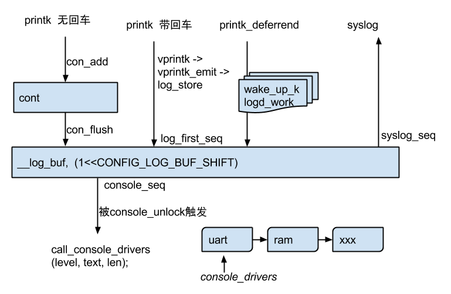

#printk学习笔记



##关键数据
struct console \*console_drivers;   链表保存所有的console

printk中每一条打印记录，并非以原始的text存储。每条语句前面都要带上管理头，用于记录时间戳，打印级别等信息。如下是log recored的结构。首先是时间戳，log打印的毫秒数，然后是整条记录总的长度，待打印文本的长度，key-value段的长度。所谓key-value，是用于为printk记录额外的信息，比如是哪个设备在打印该语句等，该结构是内核私有，从用户态看不到它。flags是该条记录的标志为，比如是否已经flush，是否带有前缀等。level则是该条语句自带的打印级别。
```c
struct log {
	u64 ts_nsec;  /* timestamp in nanoseconds */
	u16 len;  /* length of entire record */
	u16 text_len;  /* length of text buffer */
	u16 dict_len;  /* length of dictionary buffer */
	u8 facility;  /* syslog facility */
	u8 flags:5;  /* internal record flags */
	u8 level:3;  /* syslog level */
};
```
所有的log record逐条记录，当log记录到buffer的尾部时，使用一条len为0的record标记，表示log回环，需要回到最从头再来，并覆盖最开始的log。由于每条log的长度不一致，所以当overlay发生的时候，需要有一种手段去保证每条记录都是可用的。一种方法，在新增一条record的时候，如果发生overflow，首先判断现有的被overflay的buffer的size，然后将被覆盖的record都清为0。这样，当希望整个遍历所有record的时候，可以区分开start和end。kernel使用一些全局变量，记录第一条log的位置，方便判断是否发生overflay，以及被overflay的范围大小。kernel中该过程有log_store()完成。该函数还负责为每条记录添加pid，cpu，task name等信息。在调用该函数之前，需要使用spin lock保护，从而将多核并行的写操作串行化。

考虑一种情况，有的时候在printk的时候，没有添加回车符，表示说这次打印还没有结束，后续还会继续往该行打印。因此printk中引入了struct cont结构体，用于缓存连续的打印，直到出现回车符，或者说cont buffer已用空间超过buffer大小的80%。为便于实现，并没有为cont buffer申请per-cpu变量，而是在vprintk_emit准备打印之前，检查当前打印和cont中存储的进程是否相同，如果相同，则尝试继续缓存，否则直接flush到log_buffer中。


###console注册
为尽早可以看到printk的打印，需要尽早调用串口的初始化函数，便于printk写数据。
console_initcall(bcm63xx_console_init);    --> 调用console_initcall宏声明，创建一个函数指针，指向bcm63xx_console_init。该函数向printk模块注册一个console。
init.h中声明了console_init宏。
```c
#define console_initcall(fn) \
 static initcall_t __initcall_##fn \                 --> 创建静态函数指针__initcall_bcm63xx_console_init。并将该指针放入到.con_initcall.init段。
 __used __section(.con_initcall.init) = fn
```

##打印级别控制
在printk打印的时候，有的时候会在字符串加KERN_NOTICE之类的标记。分析该标记的实现，它包含两个字符，第一个是\001, 第二个字符是ascii的打印级别。可以使用printk_get_level获取到打印的级别。

printk的打印级别怎么控制？last kmsg中只能记录级别为4和5的log。可在/proc/sys/kernel/printk中查询到这几个打印级别。
```c
\#define DEFAULT_MESSAGE_LOGLEVEL CONFIG_DEFAULT_MESSAGE_LOGLEVEL
/* We show everything that is MORE important than this.. */
\#define MINIMUM_CONSOLE_LOGLEVEL 1 /* Minimum loglevel we let people use */
\#define DEFAULT_CONSOLE_LOGLEVEL 6 /* anything MORE serious than KERN_INFO */

int console_printk[4] = {
  DEFAULT_CONSOLE_LOGLEVEL, /* console_loglevel */
  DEFAULT_MESSAGE_LOGLEVEL, /* default_message_loglevel */
  MINIMUM_CONSOLE_LOGLEVEL, /* minimum_console_loglevel */
  DEFAULT_CONSOLE_LOGLEVEL, /* default_console_loglevel */
};
EXPORT_SYMBOL_GPL(console_printk);
```

###printk_deferred
printk_deferred在一些性能关键的路径上，需要延迟执行打印语句，避免打印影响性能。这种情况下可以使用printk_deferred来完成。

下面是printk_deferred的实现代码。首先，待延迟打印的buffer是放在per cpu变量中，避免smp环境下使用同步语句控制。使用va_start将fmt转化为字符串，存放到buffer中。然后，设置per cpu变量printk_pending的flag为PRINTK_PENDING_SCHED。这里实现延迟执行的函数是work queue。将预置的per-cpu worker放到irq work queue中，等待被唤醒。唤醒后检查到flag，将打印使用WARNING级别printk打印。因为irq workqueue是common的，有可能被唤醒进来，发现没有事情做，此时继续设置printk_pending中相应cpu的flag标志为为PRINTK_PENDING_WAKE_UP。

```c
int printk_deferred(const char *fmt, ...)
{
	buf = __get_cpu_var(printk_sched_buf);
	buf_length = __get_cpu_var(printk_sched_length);
	讲fmt转化到buffer中。
	i_this_cpu_or(printk_pending, PRINTK_PENDING_SCHED);
	irq_work_queue(&__get_cpu_var(wake_up_klogd_work));
}
```
在本例中，展示了work queue，wait queue的用法。

##注意点
printk可能丢log
比如last_kmsg_shutdown_1.txt中的下面这句log，在kmsg中不存在。log太多，来不及打印，被丢掉。
[  384.271628]<0> (0)[107:hps_main][HPS] (0200)(1)action end(22)(15)(0)(0) 


#uart驱动
linux中串口驱动包括两个主要的结构体：uart_driver和uart_port。
uart_driver是串口驱动的入口，需要注册到linux内核驱动框架中。包括驱动名称，导出到用户态时设备的名称ttyS，主设备号为4，从设备号为64，支持两个端口(nr)。另外，还需要指定该驱动使用的struct console对象。该对象主要供内核printk打印时输出用。
一个驱动可以对应多个端口，用uart_port来表示，用于存储端口的配置信息，如fifo大小，uartclk、寄存器的地址membase。
static struct uart_driver bcm63xx_reg = {
    .owner = THIS_MODULE,
    .driver_name = "bcmserial",
    .dev_name = "ttyS",
    .major = TTY_MAJOR,        
    .minor = 64,
    .nr = UART_NR,
    .cons = BCM63XX_CONSOLE,
};
使用uart_register_driver注册驱动，使用uart_add_one_port为驱动添加端口。


