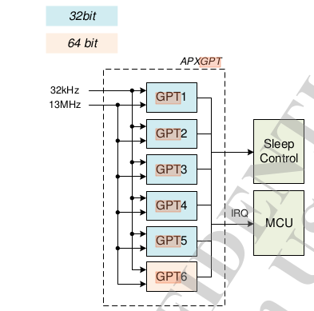

摘要t：  
本节介绍MT6753中使用的clocksource模块。
v0.1 2015/8/6 MT6753 GPT的大致文档

---

#overview
系统中有两个硬件时钟，13MHZ的system clock和32.76KHZ的RTC，分别可以达到7ns和30μs的精度。分析代码，目前GPT都使用的是13MHZ的system clock。

mt6753在系统中注册有三个时钟源，分别是APXGPT，CPUXGPT，armv8-timer。

GPT包含5个32bit的timer，1个64bit的timer。目前，实际使用上，GPT1用于CLK_SRC_ID，GPT2用于CLK_EVT_ID。Modem使用GPT3和GPT6。GPT4用于idle_gpt。

每种timer包含四种工作模式：ONESHOT，REPEAT，KEEPGO，FREERUN。这四种模式，分别代表定时器到期之后应该采取的行为。比如ONESHOT到点触发中断，之后停止，等待下次设置。REPEAT到点触发中断，之后将计数归零后重新开始计数增加，直到下次到点。KEEPGO到点后触发中断，之后计数不归零继续增加。FREERUN则是没有到点的概念，也不会触发中断。

注意这张图中，GPT到点之后如果cpu是active，触发IRQ给MCU，另外一种cpu处于suspend状态则给sleep control。（也有可能是两者都给:)）

CPUXGPT用于cpu的local的timer。

Kernel使用声明的方式为系统注册时钟源。kernel中经常使用这种方式声明数组，这里声明的数组为`__clksrc_of_table`。
CLOCKSOURCE_OF_DECLARE(mtk_apxgpt, "mediatek,APXGPT", mt_gpt_init);
