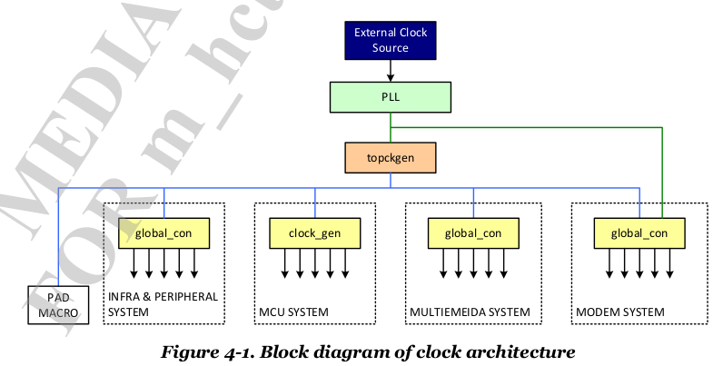

摘要t：  
本节介绍MT6753中使用的clocksource模块。
v0.1 2015/8/6 MT6753 GPT的大致文档

---

# overview
Kernel使用如下函数注册有三个时钟源，分别是APXGPT，CPUXGPT，armv8-timer。为便于理解，我们先看以下mt673的clock architecture。
CLOCKSOURCE_OF_DECLARE(mtk_apxgpt, "mediatek,APXGPT", mt_gpt_init);


在这张图中，外部时钟源（石英晶体振子？）产生外部时钟信号，经过[PLL](http://baike.baidu.com/link?url=l15pi-awtgMAlHy_7PKo3JMv9auP64l_3MfZrNswe-BcpXpKBdSojh-vziLJrchLicYdgEB4APpLzUcfotU5ZkD_FmdkTq52c-k8DaXAa8i)锁相回路和内部震荡信号同步，再通过topclkgen产生各种频率的时钟信号，并将这些信号输出到MCU，Modem，Multimedia，BUS，DDR等各个模块。这些模块通过多路器（Multiplxer）select寄存器选择合适的频率。

Kernel中包含三个clocksouce，分别是APXGPT，CPUXGPT，arch_timer。通过cat /proc/interrupts，可以看到相应的中断。然后分析中断次数，可以掌握每种clocksource在哪些场景下工作。


APXGPT，Generanl Purpose Timer向系统提供通用的定时器，系统也可以通过读取它的寄存器获取到当前的时钟。APXGPT有两个时钟源，一个13MHz的system clock，由上述的clockgen产生。另外，还有一个外部的频率为32.76KHZ的RTC也可以提供时钟信号。这两种时钟源，分别可以达到7ns和30μs的精度。可以通过配置寄存器的形式为GPT选择合适的时钟源，目前使用的是13MHZ的system clock。

CPUXGPT，使用arm core内部的virturl timer counter作源头。

archv8-timer使用arm core内部的physcial timer作为源头。

# APXGPT


在模块外部，它有两个输入信号，分别是RTC和system clock。有两个输出信号，分别给IRQ和sleep control。GPT到点之后如果cpu是active，触发IRQ给MCU，另外一种cpu处于suspend状态则给sleep control。（也有可能是两者都给:)）

在模块内部，它包含5个32bit的timer，1个64bit的timer。目前，实际使用上，GPT1用于CLK_SRC_ID，GPT2用于CLK_EVT_ID。Modem使用GPT3和GPT6。GPT4用于idle_gpt。每种timer包含四种工作模式：ONESHOT，REPEAT，KEEPGO，FREERUN。这四种模式，分别代表定时器到期之后应该采取的行为。比如ONESHOT到点触发中断，之后停止，等待下次设置。REPEAT到点触发中断，之后将计数归零后重新开始计数增加，直到下次到点。KEEPGO到点后触发中断，之后计数不归零继续增加。FREERUN则是没有到点的概念，也不会触发中断。

## 寄存器
```
#define GPT_IRQEN           (AP_XGPT_BASE + 0x0000)
#define GPT_IRQSTA          (AP_XGPT_BASE + 0x0004)
#define GPT_IRQACK          (AP_XGPT_BASE + 0x0008)
#define GPT1_BASE           (AP_XGPT_BASE + 0x0010)
        GPTx_BASE           (GPT1_BASE1 + 0x10 * (x-1))
每个GPT特有的寄存器
#define GPT_CON             (0x00)   //GPTx_BASE + GPT_CON
#define GPT_CLK             (0x04)   //GPTx_BASE + GPT_CLK
#define GPT_CNT             (0x08)   //GPTx_BASE + GPT_CNT
#define GPT_CMP             (0x0C)   //GPTx_BASE + GPT_CMP

```

## 使用流程
在mt_gpt.c中，使用CLOCKSOURCE_OF_DECLARE静态声明APXCPT clock source，并在系统初始化时会调用到mt_gpt_init()完成实际的初始化工作。关于GPT的参数，都配置在devcie tree中，初始化时读取GPT的clock-frequency，tmr_irq, tmr_reg信息。因此已经获取到GPT的base address，此时已经可以通过GPT获取系统clock信息了。事实上，在mt_gpt_init的过程中，会使用xgpt_boot_up_time()函数去读取GPT4的cnt register，得到当前系统运行以ms为单位的时间。通过这个时间信息，我们可以得知在LK和Kernel之间运行了多长时间。

kernel使用gpt_device结构体来管理单个的GPT，使用gpt_devs数组来管理所有的GPT。使用者可以方便使用id_to_dev在id和gpt_dev之间转换。
```c
struct gpt_device {
    unsigned int id;    //gpt id， 0~5
    unsigned int mode;  //FREE_RUN，REPEAT等
    unsigned int clksrc;   //clk src, system clock or rtc clock
    unsigned int clkdiv;  //clock精度，clksrc除clkdiv
    unsigned int cmp[2];  //到点时间
    void (*func)(unsigned long); //clock handle
    int flags;    //CLK_ISR，是否支持ISR，CLK_INUSE，是否已使用。
    int features;  //whether support 64bit timer
    unsigned long base_addr;  //this gpt timer local register
};
```

GPT1用于clk source，在setup_clksrc(freq)中注册为FREE_MODE, 无中断触发，使用system clock的timer。将在分析timer的code中再回过头来看clk source相关的实现代码。GPT2用于clk event，在setup_clkevent(freq)中注册为GPT_REPEAT类型，system clock，cmp为freq/HZ，意味着每个HZ都会产生中断。同样，event相关的细节在后续章节再分析。GPT4为idle_gpt，在mt_idle_legacy.c中注册，类型为GPT_ONTSHOT，flag为GPT_NORETURN，默认也没有注册中断函数。（奇怪）


# CPUXGPT
##使用场景
在手机Soc中，为省电，需要将不用的cpu shutdown。在该场景下，一个需求就是判断合适cpu不用。这是cpuxgpt的应用场景，用于cpu idle检测。因为需要针对单独每一颗cpu shutdown，所以需要cpu local的timer。

##寄存器
DataSheet中关于CPUXGPT的资料含混不清，而且手册中CPUXGPT寄存器的编号为96~103，这与device tree中定义的中断编号也对应不上来。因此对CPUXGPT的study主要依据分析code来。主要从两个方面来分析：谁在用它，它是专门实现的。涉及到的寄存器手册，以code中实际使用的为准。

通过code分析，CPUXGPT使用类似shadom寄存器的方法操作，也就是部分寄存器的值不能直接去读，必须要先向控制寄存器写值，切换到某类寄存器上下文，然后才能去读取。写操作也有类似的限制。对应到代码上，__read_cpuxgpt和__write_cpuxgpt这两个函数，都必须先向index base phy写入index，然后再去ctrl base中读取。如下代码：

```c
static unsigned int __read_cpuxgpt(unsigned int reg_index )
{
  	unsigned int value = 0;
  	mcusys_smc_write_phy(INDEX_BASE_PHY,reg_index);
  	value = DRV_Reg32(CTL_BASE);
  	return value;
}
```
该代码用于读取cpuxgpt的寄存器。读取方法，首先向INDEX_BASE_PHY寄存器（0x10200674）写入待读取寄存器的index，然后再去CTL_BASE（0x10200670）上读取index寄存器的值。写操作也有类似的流程。用这种方式，可以最大化节约寄存器的数量。在此处，用2个寄存器就完成了原本需要很多寄存器才能做到的事情。当然，增加了software的设计工作量。但实际上，mt_cpuxgpt.c中，也仅仅用到CTL_BASE和INDEX_BASE_PHY这两组寄存器，而整个cpuxgpt的寄存器大小为4K，也即可以存放1024个寄存器。也许有写隐藏的寄存器，功能我们不直到？:(

来大概看以下CPUXGPT定义的寄存器：
```
#define INDEX_CTL_REG  0x000    //控制寄存器，控制cpuxgpt是否使能。bit0: enable，bit1: debug enable
#define INDEX_STA_REG  0x004    //状态寄存器，
#define INDEX_CNT_L_INIT    0x008  //供wdt_test.c用，写入初值
#define INDEX_CNT_H_INIT    0x00C
#define INDEX_IRQ_MASK    0x030 //0~7 bit mask cnt0~cnt7 interrupt
#define INDEX_CMP_BASE  0x034  //cpuxgpt 1, 8 Byte, cpu_xgpt_set_timer用
                        0x03C  //cpuxgpt 2, 8 Byte
                        0x044  //cpuxgpt 3, 8 Byte
```
重点看以下INDEX_CMP_BASE寄存器，它用于设定cpuxgpt的timer，每个cpu对应一个index。首先，我们需要通过mrs指令读取arm虚拟定时器计数寄存器（cntvct_el0）。

```c
static inline u64 arch_counter_get_cntvct(void)
{
	u64 cval;
	isb();
	asm volatile("mrs %0, cntvct_el0" : "=r" (cval));
	return cval;
}
```

## 设计原理

# arch-timer
arch-timer为各个cpu core中进程切换所需要的HZ。

## 标准
在ARM中，外部中断包括PPI（private），SPI（shared）两类，前者是per cpu独享的，后者是所有cpu core共享的。arch-timer是每个cpu私有的timer，使用PPI。在申请号时，使用request_percpu_irq接口。

按照ARM架构，支持四种类型的arch timer。每种timer都需要向系统提供计数信号，以及可触发PPI中断。要求每个core上使用的PPI中断编号一致。EL1 physical timer定时器包含non-secure和secure，我理解当处于secure world时，secure physical timer可访问可控制。

* secure EL1 physical timer, PHYS_SECURE_PPI。
* non-secure EL1 physical timer, PHYS_NONSECURE_PPI
* non-secure EL2 physical timer, HYP_PPI
* virtual timer, VIRT_PPI。可从Non-Secure/Secure EL1，EL2, EL0（可配置）访问。

所谓的virtual timer，表示会从实际的physical counter上减去当前virtual machine的值。当前virtual timer的值存在cntvct_el0寄存器中。

每个timer向外提供三种寄存器：

* 64bit compare value, 向上增寄存器，指定时间达到后trigger。
* 32bit timer value，递减倒计时寄存器，到到0时trigger 相应PPI。
* 32bit control value, 控制寄存器

## 函数接口
```c
int request_percpu_irq(unsigned int irq, irq_handler_t handler,
		   const char *devname, void __percpu *percpu_dev_id);
```
这段代码是arch-timer申请中断时使用的接口。分析ca53_timer.c中，使用到Non-secure和Secure physical EL1 register。因此注册了PHYS_SECURE_PPI和PHYS_NONSECURE_PPI两种中断。第二个参数为中断处理函数，读取寄存器的值。第三个参数为timer名称。第四个参数为timer处理设备，是timer的处理函数，在中断处理函数中调用。

