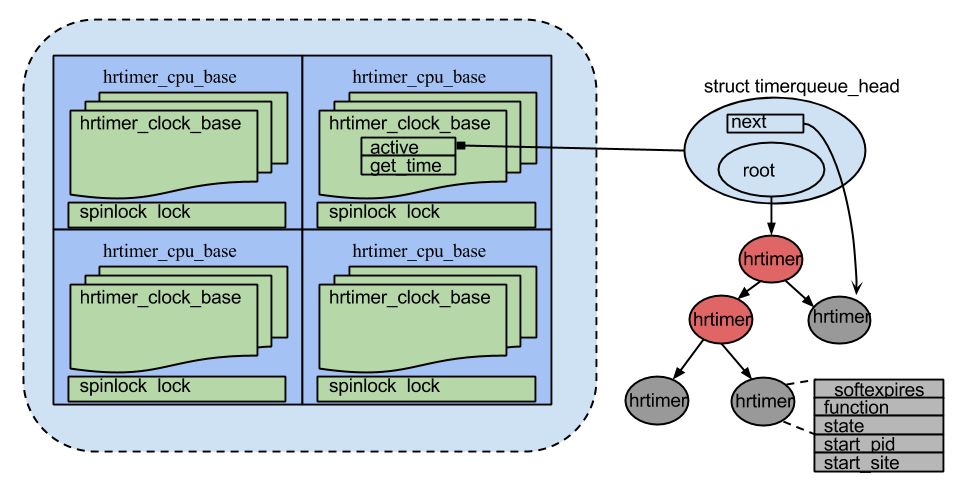

摘要：  
本文总结hrtimer相关的知识

---
#核心理念

#对外的API
void hrtimer_init(* timer, clock_id, mode)  初始化一个hrtimer  
int hrtimer_start(* timer, time, mode)  为这个timer制定expire time  
int hrtimer_cancel(* timer)  取消一个hrtimer

#数据结构
posix.1b标准中规定了很多clock的类型，hrtimer实现了其中的四种（HRTIMER_BASE_MONOTONIC, HRTIMER_BASE_REALTIME, HRTIMER_BASE_BOOTTIME, HRTIMER_BASE_TAI），使用per-cpu变量hrtimer_bases来维护这些hrtimer。为便于管理，使用hrtimer_clockid_to_base将clockid转换为hrtimer index。

核心数据结构包括三个，hrtimer_cpu_base, hrtimer_clock_base, hrtimer。当cpu hotplug发生时，hrtimer可能在不同的cpu之间迁移，所以需要描述某个cpu上某个clock类型的timer。一个clock_base使用红黑树来管理它所有的hrtimer，另外，为了加快访问速度，还使用一个next指针指向即将被使用到的hrtimer。

#代码流程

---
参考：  
Documents/hrtimer.txt
